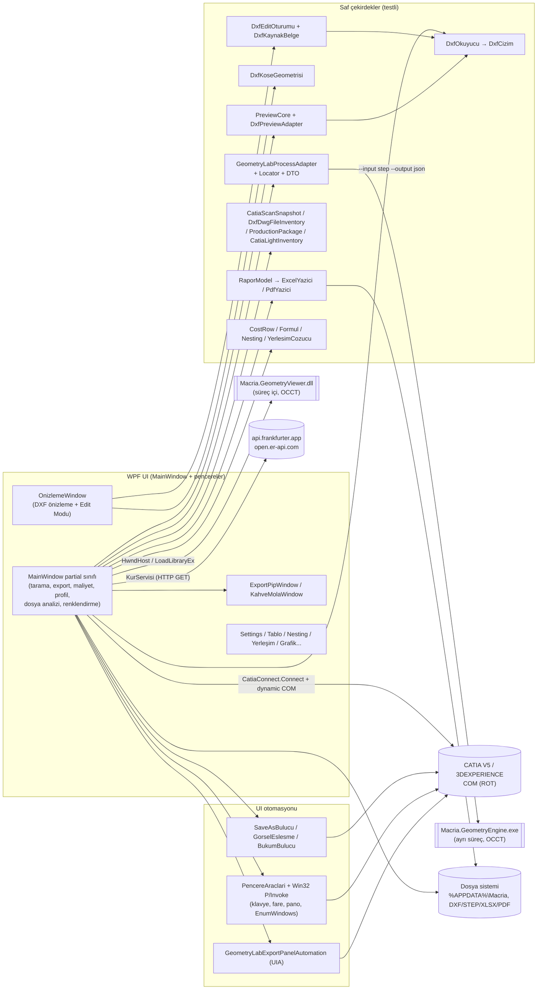
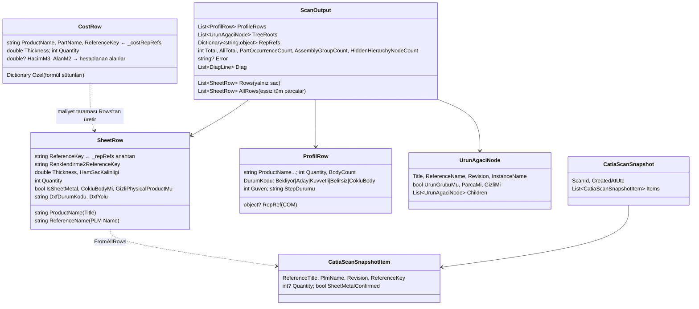

# MACRIA — Proje Genel Bakışı (kod erişimi olmayan okuyucu için)

- **Hazırlanma tarihi:** 2026-09-27
- **Kaynak:** Repo kökü `Macria-main_Ey/`, branch `enes-yesiloz`, son commit `f6f0c33`.
- **Kod sürümü:** `1.11.2` (`Macria/Macria.csproj`).

**Yöntem**

- Tüm kaynak dosyalar tarandı; önemli dosyalar satır satır okundu.
- Ana uygulama Debug x64 olarak derlendi.
- İki konsol test projesi çalıştırıldı.
- CATIA gerektiren hiçbir davranış çalıştırılarak doğrulanmadı. Bu davranışlar yalnızca koddan okunarak anlatılmıştır.

**Yazım kuralları**

- Yalnızca kodda görülen bilgiler yazıldı.
- Koddan doğrulanamayan veya yoruma açık yerler **⚠️ Belirsiz** olarak işaretlendi.
- Satır numaraları bu tarihteki çalışma kopyasına aittir; kod değiştikçe kayabilir.
- Gizli değer (şifre, token, API anahtarı) repoda bulunamadı. Ortam değişkenleri yalnızca adlarıyla verilmiştir.

---

## İçindekiler

1. [Genel Bakış](#1-genel-bakış)
2. [Klasör Yapısı](#2-klasör-yapısı)
3. [Mimari](#3-mimari)
4. [Modül / Dosya Detayları](#4-modül--dosya-detayları)
5. [Veri Modeli](#5-veri-modeli)
6. [API ve Entegrasyonlar](#6-api-ve-entegrasyonlar)
7. [Yapılandırma ve Çalıştırma](#7-yapılandırma-ve-çalıştırma)
8. [Durum Analizi](#8-durum-analizi)
9. [Sorunlar ve Riskler](#9-sorunlar-ve-riskler)
10. [Kritik Kod Parçaları](#10-kritik-kod-parçaları)
11. [Özet](#11-özet)
12. [İnceleme kapsamı](#12-i̇nceleme-kapsamı)

---

## 1. Genel Bakış

### 1.1 Amaç

Macria, Windows x64 üzerinde çalışan bir WPF masaüstü uygulamasıdır. **Çalışan bir CATIA V5 / 3DEXPERIENCE oturumuna COM ile bağlanır**, aktif montajı (Physical Product) tarar ve bu taramaya dayanarak üretim hazırlığına yönelik işler yapar:

| Özellik | Ne yapar | Ana dosyalar |
|---|---|---|
| **Montaj tarama** | Occurrence ağacını gezer. Eşsiz parçaları, sac parçaları ve hiyerarşik ürün ağacını çıkarır. Adetleri toplar. Gizli ve Çoklu Body öğeleri işaretler. | `MainWindow.xaml.cs` (`DoScan`, `ScanNode`, `GetThickness`) |
| **Toplu / tekil DXF export** | CATIA'nın "Save As DXF" panelini **gerçek fare tıklaması ve klavye olaylarıyla** sürerek sac açınımı DXF'lerini üretir. | `MainWindow.xaml.cs` (`ExportOneIc`), `SaveAsBulucu`, `BukumBulucu`, `GorselEslesme`, `PencereAraclari` |
| **DXF önizleme + DXF Edit Modu** | ASCII DXF okur ve çizer. Silme, pah, radius ve birleştirme yapar. Undo/Redo, `.bak` yedeği ve atomik kayıt sağlar. | `DxfOkuyucu`, `DxfEditOturumu`, `DxfKoseGeometrisi`, `OnizlemeWindow` |
| **Ağırlık ve maliyet** | Her sac parçayı açar; hacim ve alanı CATIA ölçüm servislerinden okur. Ağırlık, kesim boyu ve maliyeti hesaplar. Kullanıcı formüllü sütun ekleyebilir. Excel/PDF rapor, grafik, ısı haritası ve plaka tahmini (nesting) sunar. | `MainWindow.Maliyet.cs`, `MaliyetModel`, `Formul`, `TabloAyari`, `Nesting`, `ExcelYazici`, `PdfYazici`, `KurServisi` |
| **Görsel yerleşim** | DXF konturlarını plakalara MaxRects algoritmasıyla (dikdörtgen bazlı) yerleştirir. | `Yerlesim`, `YerlesimCozucu`, `YerlesimWindow` |
| **Kutu Profil (deneysel)** | Sac olmayan katıları aday olarak listeler. Seçili parçayı açıp puanlı bir teşhis yapar (Body/feature, 2V/A et kalınlığı, atalet oranı, yüz sayısı) ve STEP export eder. | `MainWindow.Profil.cs`, `ProfilModel` |
| **GeometryLab / GeometryEngine** | Harici, OCCT tabanlı native bir analiz motorunu (`Macria.GeometryEngine.exe`) ayrı süreçte çalıştırır. STEP'ten profil türü, kesit, boy ve kesim açısı alır. | `GeometryLab*`, `MainWindow.GeometryLab.cs`, `MainWindow.ExternalStepProfiles.cs` |
| **Dosya Analiz Merkezi** | Haricî STEP dosyalarını toplu analiz eder. DXF/DWG klasörünü tarar ve dosyaları son CATIA taramasıyla eşleştirir. 2B DXF ve 3B STEP önizleme sunar. Üretim paketi (çarpanlı adetle yeniden adlandırılmış kopyalar ve Excel manifesti) oluşturur. | `MainWindow.DxfDwgFiles.cs`, `DxfDwgFileInventory`, `ProductionPackage*`, `OcctViewportHost`, `PreviewCore` |
| **Renklendirme** | Montajdaki parçalara PLM kimliğine göre renk verir ve renkleri "Automatic"e geri döndürür. İki sürüm var: "Akıllı Renklendirme" ve "Renklendirme 2.0". | `MainWindow.AkilliRenklendirme.cs`, `MainWindow.Renklendirme2.cs`, `CatiaColorTargetService`, `Renklendirme2Paleti` |

**Hedef kullanıcı:** Kod ve README'den anlaşıldığı kadarıyla BMC firmasında CATIA / 3DEXPERIENCE ile çalışan, lazer kesim ve profil üretimi hazırlayan tasarım ve üretim mühendisleri.

- csproj künyesi: `Company=BMC`, `Authors=Enes Yeşilöz, Emre Koçak`.
- UI metinleri, loglar ve kod tanımlayıcılarının çoğu **Türkçedir**.

### 1.2 Diller, framework'ler, kütüphaneler

| Bileşen | Sürüm / Kaynak | Not |
|---|---|---|
| C# / .NET | `net8.0-windows` (`Macria.csproj`), `Nullable=enable`, `ImplicitUsings=enable` | `PlatformTarget=x64` |
| WPF | .NET 8 ile birlikte gelir (`UseWPF=true`) | Tek pencere + çok sayıda yardımcı pencere |
| NuGet: **WPF-UI** | `[4.3.0]`, tam sürüm sabitli | Yalnızca `AboutWindow` kullanıyor (`ui:FluentWindow`, `ThemesDictionary`, `ControlsDictionary`). AGENTS.md: güncellemeden önce AboutWindow görsel olarak test edilmeli. |
| Diğer NuGet paketi | **Yok** | Excel (.xlsx) ve PDF yazıcıları kütüphanesiz, elle üretiliyor. |
| .NET BCL kullanımları | `System.Text.Json`, `System.IO.Compression` (xlsx/zip), `System.Net.Http` (döviz kuru), `System.Windows.Automation` (UIA), `System.Security.Cryptography` (SHA-256 ile renk üretimi) | |
| Win32 P/Invoke | `user32` (EnumWindows, SendMessage, keybd_event, mouse_event, SetCursorPos…), `gdi32` (BitBlt ile ekran yakalama), `ole32` / `oleaut32` (ROT, GetActiveObject), `kernel32` (LoadLibraryEx) | |
| COM | CATIA Automation, `dynamic` ile geç bağlama (tip kütüphanesi referansı yok) | |
| Native (prebuilt) | OCCT tabanlı `Macria.GeometryEngine.exe` + `Macria.GeometryViewer.dll` ve bağımlılıkları (`TK*.dll`, `tbb12`, `freetype`, `FreeImage`, ffmpeg DLL'leri, `openvr_api`, MSVC runtime) | Kaynak kodu bu repoda **yok**. Yalnızca ikili dosyalar `GeometryEngineRuntime/` altında. OCCT sürümü ⚠️ Belirsiz. |
| Test | Harici test framework'ü yok (xUnit/NUnit yok). 3 konsol programı; `Main` her testi sırayla çağırır ve 0/1 ile çıkar. | |

**package.json / requirements.txt / pubspec benzeri dosya yok.** Bağımlılık tanımları yalnızca `.csproj` dosyalarındadır.

---

## 2. Klasör Yapısı

### 2.1 Dizin ağacı

Derleme çıktıları ve arşivler ağaçta yalnızca adıyla gösterilmiştir.

```text
Macria-main_Ey/                          (repo kökü)
├── .gitignore                           bin/obj/publish/zip/arşiv klasörlerini dışlar
├── .vscode/
│   ├── tasks.json                       "build Macria" (dotnet build, Debug, x64) — varsayılan build task
│   └── launch.json                      coreclr ile bin/x64/Debug/net8.0-windows/Macria.dll başlatır
├── .serena/                             (izlenmeyen) Serena araç durumu — proje kodu değil
├── .vs/                                 (izlenmeyen) Visual Studio önbelleği — ATLANDI
├── .line-line-verification/             eski doğrulama build çıktısı (yalnız bin/) — ATLANDI
├── AGENTS.md                            Bağlayıcı proje çalışma kuralları (Türkçe)
├── CLAUDE.md                            (izlenmeyen) Yapay zekâ asistanları için proje özeti
├── INCELEME-RAPORU-2026-09-26.md        (izlenmeyen) Önceki kod inceleme raporu
├── README.md                            Kullanıcı/geliştirici README (v1.10.4 anlatımı — ESKİ)
├── SURUM-NOTLARI-v1.10.4.md             v1.10.4 sürüm notları
├── PROFIL-DENEYSEL-TEST.md              Kutu Profil/STEP deneme rehberi (v1.10.4)
├── Macria.slnx                          Çözüm: YALNIZ Macria/Macria.csproj içerir
├── DesignReferences/
│   └── Enes-Kahve-Penceresi-Referans.png  Kahve animasyonu karakter tasarım referansı
├── GeometryEngineRuntime/               Prebuilt OCCT motoru + viewer DLL + bağımlılıklar (38 ikili + README)
│   ├── Macria.GeometryEngine.exe        Ayrı süreçte çalışan analiz motoru
│   ├── Macria.GeometryViewer.dll        Macria sürecine LoadLibraryEx ile yüklenen 3B görüntüleyici
│   ├── TK*.dll, tbb12, jemalloc, freetype, FreeImage, avcodec/avformat/avutil/swscale, openvr_api, MSVCP140/VCRUNTIME140(_1)
│   └── README.md                        Paket güncelleme kuralı (iddiası kısmen eskimiş, bkz. §9)
├── DxfEdit.Tests/
│   ├── DxfEdit.Tests.csproj             Macria'daki DXF/önizleme/renk dosyalarını link ile derler
│   ├── Program.cs                       ~29 test grubu, 1031 doğrulama (2026-09-27 koşumu)
│   └── README.md                        Test kapsamı ve ACL/File.Replace notu
├── DxfEdit.UiTests/
│   ├── DxfEdit.UiTests.csproj           Referanssız; derlenmiş Macria.dll'i reflection ile yükler
│   └── Program.cs                       OnizlemeWindow Edit Modu smoke testi
├── GeometryLabAdapter.Tests/
│   ├── GeometryLabAdapter.Tests.csproj  net8.0 (WPF'siz); GeometryLab/PreviewCore/ProductionPackage/Excel dosyalarını link eder
│   ├── Program.cs                       ~29 test, 480 doğrulama; gerçek motor testleri env var ister
│   └── SheetRowStub.cs                  Testte SheetRow'un COM'suz sahte hali
├── Macria/                              ANA UYGULAMA (90 .cs, 18 .xaml, ~35.2k satır C#, ~6.7k satır XAML)
│   ├── Macria.csproj                    Sürüm 1.11.2, WPF-UI 4.3.0, GeometryEngine içeriğini kopyalar
│   ├── App.xaml / App.xaml.cs           Tema kaynakları (renk fırçaları, stiller); kültür ayarı
│   ├── AssemblyInfo.cs                  WPF ThemeInfo
│   ├── Assets/                          25 görsel (ikon, logo, rehber, durum ikonları, kahve animasyon kareleri)
│   ├── MainWindow.xaml(.cs) + 21 partial  UYGULAMANIN KENDİSİ (aşağıda §4)
│   ├── [CATIA]    CatiaConnect, ComProbe, PencereAraclari, CatiaColorTargetService, CatiaLightInventory, CatiaScanSnapshot
│   ├── [DXF UI otomasyonu] SaveAsBulucu, BukumBulucu, GorselEslesme
│   ├── [DXF]      DxfOkuyucu, DxfEditOturumu, DxfKoseGeometrisi, DxfPreviewAdapter, DxfDwgPreviewMessages, DxfDwgFileInventory
│   ├── [Önizleme] PreviewCore, OcctStepPreviewAdapter, OcctViewportHost, OcctViewportHostPort, OcctViewerNative, OcctPreviewWindow
│   ├── [GeometryLab] GeometryLabProcessAdapter, GeometryLabEngineLocator, GeometryLabTransportDtos, GeometryLabStepProfileListItem, GeometryLabTemporaryStepExporter, GeometryLabExportPanelAutomation, ManualHollowProfileWindow
│   ├── [Maliyet]  MaliyetModel, Formul, TabloAyari, IsiHaritasi, GrafikCizer, Nesting, KurServisi
│   ├── [Rapor]    RaporModel, ExcelYazici, PdfYazici
│   ├── [Yerleşim] Yerlesim (DxfAdi dahil), YerlesimCozucu
│   ├── [Profil]   ProfilModel
│   ├── [Renk]     AkilliRenklendirme, Renklendirme2Paleti, Renklendirme2UiModel
│   ├── [Ayar/Model] Ayarlar, HamSacKalinliklari, ParcaSutunAyari, UrunAgaciNode, ProductionPackage
│   ├── [Pencereler] *Window.xaml(.cs) (17 adet) + ProductionPackageWindow.cs (kodla kurulan) + WindowEffects
│   ├── bin/ (629 MB), obj/ (110 MB)     derleme çıktısı — ATLANDI
│   └── publish/Macria_v1.11.2_IsYeri_Test/  (228 MB, gitignore'da) single-file Macria.exe + GeometryEngine/ — ATLANDI
├── ExeArsivi/                           eski exe arşivi (gitignore) — ATLANDI
├── Macria-v1.11.0-IsYeri-Test/          sürüm arşivi (gitignore) — ATLANDI
├── Macria_v1.11.1_IsYeri_Test/          sürüm arşivi (gitignore) — ATLANDI
└── Macria_v1.11.1_IsYeri_Test.zip       ~98 MB arşiv (gitignore) — ATLANDI
```

### 2.2 Macria/ içindeki her dosyanın bir satırlık açıklaması

**MainWindow partial'ları (tek `MainWindow` sınıfı):**

| Dosya | Satır | Görev |
|---|---:|---|
| `MainWindow.xaml` | 2802 | Tüm ana UI: menü karoları, Export, Maliyet, Dosya Analiz Merkezi ve Renklendirme görünümleri, sekmeler, konsol |
| `MainWindow.xaml.cs` | 4989 | `SheetRow`, `LogEntry`, ortak durum; konsol, arama/filtre, gezinme, PiP; DXF önizleme; tarama; kalınlık ve Sheet Metal doğrulama; DXF export UI otomasyonu; onay kutusu izleyicisi |
| `MainWindow.Maliyet.cs` | 1154 | Maliyet sekmesi: tablo kurulumu, ısı haritası, kur, parça ölçümü (InertiaService/MeasureService), Excel/PDF |
| `MainWindow.Profil.cs` | 1633 | Kutu Profil: aday oluşturma, detaylı teşhis + puanlama, rapor (.txt), STEP export (ExportData + Export UI) |
| `MainWindow.GeometryLab.cs` | 378 | "GeometryLab ile Test Et": CATIA'dan geçici STEP üretir, motoru çağırır, sonucu MessageBox'ta gösterir |
| `MainWindow.ExternalStepProfiles.cs` | 379 | Haricî STEP toplu analizi, filtreler, kullanıcı kararları, Excel, CATIA karşılaştırma |
| `MainWindow.ExternalStepPreview.cs` | 108 | Gömülü OCCT 3B görünüm ve büyük önizleme penceresi |
| `MainWindow.DxfDwgFiles.cs` | 247 | DXF/DWG klasör taraması, eşleştirme, filtre, 2B önizleme (`DxfPreviewAdapter` ile), Excel |
| `MainWindow.ProductionPackage.cs` | 51 | DXF/DWG ve STEP listelerinden Üretim Paketi penceresini açar |
| `MainWindow.Renklendirme2.cs` | 970 | Renklendirme 2.0: PartBody hedeflerini çözer, 72 renkli palet uygular, Automatic'e döndürür |
| `MainWindow.AkilliRenklendirme.cs` | 221 | Akıllı Renklendirme (v1): SHA-256 tabanlı renk; occurrence'ları boyar |
| `MainWindow.Bildirim.cs` | 219 | Konsol kapalıyken köşede görünen bildirim kartları |
| `MainWindow.RenkEnvanteriTesti.cs` | 425 | Teşhis handler'ı (ölü) + **canlı kullanılan** `CatiaLightInventoryReader` |
| `MainWindow.PartBodyHedefKesfi.cs` | 211 | Teşhis handler'ı (ölü) + **canlı kullanılan** `ResolveMountedPartBody` |
| `MainWindow.TopluPartBodyHedefCozumleme.cs` | 316 | Teşhis handler'ı (ölü) + **canlı kullanılan** `ResolveBulkPartBodyTargets` |
| `MainWindow.NativeResetAbTesti.cs` | 745 | Renk reset A/B deneyi — **tamamen ölü kod** |
| `MainWindow.PartBodyAutomaticAbTesti.cs` | 714 | Renk A/B deneyi — **tamamen ölü kod** |
| `MainWindow.ResetPropertyKontrolluTeshisi.cs` | 918 | Renk reset teşhisi — **tamamen ölü kod** |
| `MainWindow.FaceSelectionContextRoundTripTeshisi.cs` | 498 | Yüz seçim teşhisi — **tamamen ölü kod** |
| `MainWindow.SelectedElementYetenekTeshisi.cs` | 223 | COM yetenek probu — **tamamen ölü kod** |
| `MainWindow.RenkHedefiTesti.cs` | 198 | Renk hedefi testi — **tamamen ölü kod** |
| `MainWindow.RenkDurumuTeshisi.cs` | 294 | Renk durumu teşhisi — **tamamen ölü kod** |
| `MainWindow.TekReferansPartBodyRenkTesti.cs` | 449 | Tek referans renk testi — **tamamen ölü kod** |

**Diğer sınıflar:**

| Dosya | Satır | Görev |
|---|---:|---|
| `CatiaConnect.cs` | 457 | COM bağlantı zinciri (ProgID → sabit CLSID → ROT taraması) + bağlantı teşhisi + HRESULT açıklamaları |
| `ComProbe.cs` | 142 | COM nesnesinin tip adını ve IDispatch üye listesini okur (teşhis) |
| `PencereAraclari.cs` | 190 | CATIA pencerelerini süreç adına göre bulur; öğretilmiş Save As noktasını ekran koordinatına çevirir |
| `SaveAsBulucu.cs` | 549 | Save As düğmesini ekrandaki görüntüden bulur (NCC, 3 kademe); `saveas.png` örneğini saklar |
| `GorselEslesme.cs` | 511 | Genel görsel eşleştirme motoru (BukumBulucu kullanır; SaveAsBulucu kendi kopyasını taşır) |
| `BukumBulucu.cs` | 219 | "Bend Information" onay kutusunu bulur ve işaretli olup olmadığını renkten okur |
| `CatiaColorTargetService.cs` | 508 | Renk hedefi (Occurrence/PartBody/Product) çözümü; `VisProperties` ile oku/yaz/reset |
| `CatiaLightInventory.cs` | 177 | COM'suz hafif occurrence envanteri (eşsiz parça + grup), test edilebilir |
| `CatiaScanSnapshot.cs` | 36 | Son CATIA taramasının COM'suz anlık görüntüsü + dosya adı ↔ Title eşleştirici |
| `DxfOkuyucu.cs` | 663 | ASCII DXF ayrıştırıcı → `DxfCizim` (çizgi parçalarına bölünmüş geometri) |
| `DxfEditOturumu.cs` | 836 | `DxfKaynakBelge` (bayt düzeyinde kaynak kimliği ve yamalar) + `DxfEditOturumu` (undo/redo, kayıt) |
| `DxfKoseGeometrisi.cs` | 627 | Pah, fillet ve birleştirme planları; kapalı kontur bulma |
| `DxfPreviewAdapter.cs` | 102 | PreviewCore üzerinden salt-okunur DXF 2B okuma |
| `DxfDwgPreviewMessages.cs` | 33 | DXF/DWG paneli kullanıcı mesajları |
| `DxfDwgFileInventory.cs` | 143 | Klasördeki DXF/DWG'leri tarar; dosya adını CATIA Title ile eşleştirir |
| `PreviewCore.cs` | 194 | WPF'siz önizleme istek çözümleyici (içerik türü, yetenek, sunum) |
| `OcctStepPreviewAdapter.cs` | 91 | STEP 3B önizleme adaptörü — **üretimde kullanılmıyor**, yalnız testte |
| `OcctViewportHostPort.cs` | 20 | Adaptör için port — **üretimde kullanılmıyor** |
| `OcctViewportHost.cs` | 336 | `HwndHost`: native OCCT viewer'ı WPF içine gömer |
| `OcctViewerNative.cs` | 192 | `Macria.GeometryViewer.dll`'i LoadLibraryEx ile yükler; export fonksiyonlarını delegate'e bağlar |
| `OcctPreviewWindow.xaml(.cs)` | 115/88 | Büyük 3B STEP önizleme penceresi |
| `GeometryLabProcessAdapter.cs` | 269 | Motoru ayrı süreçte çalıştırır: timeout, iptal, kill-tree, JSON şema kontrolü |
| `GeometryLabEngineLocator.cs` | 124 | Motor yolunu bulur (paketlenmiş → `MACRIA_GEOMETRY_ENGINE_PATH`) + gerekli DLL listesi |
| `GeometryLabTransportDtos.cs` | 298 | Motor JSON sözleşmesi (schema 1.0) record'ları |
| `GeometryLabStepProfileListItem.cs` | 633 | Haricî STEP satır modeli: otomatik sınıflama, kullanıcı kararı, CATIA eşleşmesi |
| `GeometryLabTemporaryStepExporter.cs` | 206 | Uygulamaya ait GUID klasöründe geçici `input.stp` üretimi ve doğrulaması |
| `GeometryLabExportPanelAutomation.cs` | 803 | CATIA "Export" panelini UIA ile etiket bazlı doldurur ve geri okuyarak doğrular |
| `ManualHollowProfileWindow.cs` | 123 | Kodla kurulan diyalog: kullanıcı elle profil türü ve kesit girer |
| `MaliyetModel.cs` | 342 | `Malzeme`, `MalzemeDeposu` (özel malzemeler), `CostRow` (hesap) |
| `Formul.cs` | 319 | Özel sütunlar için özyinelemeli ayrıştırıcıyla hesap makinesi |
| `TabloAyari.cs` | 288 | Maliyet tablosu sütun/parametre tanımları ve `tablo.txt` kalıcılığı |
| `IsiHaritasi.cs` | 127 | Sayısal hücrelerin sütun içi min–max aralığına göre renk tonu |
| `GrafikCizer.cs` | 386 | Canvas üzerinde dikey/yatay çubuk ve halka grafik |
| `Nesting.cs` | 188 | Alan bazlı plaka sayısı ve fire tahmini (kalınlığa göre gruplar) |
| `KurServisi.cs` | 226 | EUR/USD/TRY kurları (frankfurter → er-api → kayıtlı → gömülü) |
| `RaporModel.cs` | 51 | Biçimden bağımsız rapor modeli |
| `ExcelYazici.cs` | 308 | Kütüphanesiz .xlsx (zip + XML) yazıcı |
| `PdfYazici.cs` | 691 | WPF ile sayfa çizip görüntüyü PDF'e gömen A4 yatay yazıcı |
| `Yerlesim.cs` | 502 | `DxfAdi` (DXF dosya adı tek kaynak), yerleşim modeli |
| `YerlesimCozucu.cs` | 256 | MaxRects (Best Short Side Fit) otomatik yerleşim |
| `ProfilModel.cs` | 240 | `ProfilRow` (Kutu Profil satırı, INotifyPropertyChanged) |
| `AkilliRenklendirme.cs` | 164 | Referans anahtarı üretimi, SHA-256 → HSV renk, yaprak bulma, işleme döngüsü |
| `Renklendirme2Paleti.cs` | 190 | Deterministik 72 renkli palet ve renk planı |
| `Renklendirme2UiModel.cs` | 135 | Renklendirme 2.0 satır UI modeli |
| `Ayarlar.cs` | 203 | Makineye özel ayarlar (`%APPDATA%\Macria\ayarlar.txt`) |
| `HamSacKalinliklari.cs` | 201 | Ham sac kalınlığı ayrıştırma/gösterme + eski kalıcı dosyayı silme |
| `ParcaSutunAyari.cs` | 120 | Sac/Ürün Ağacı tablolarındaki sütun görünürlüğü ve sırası (`parca-sutunlari.txt`) |
| `UrunAgaciNode.cs` | 69 | Hiyerarşik ağaç düğümü (COM'suz) |
| `ProductionPackage.cs` | 96 | Üretim paketi satırı ve adet doğrulama + kopyalama servisi |
| `ProductionPackageWindow.cs` | 93 | Üretim paketi penceresi (kodla kurulan UI) |
| `WindowEffects.cs` | 51 | Windows 11 yuvarlatılmış köşe (DWM) |
| Diğer pencereler | — | `AboutWindow`, `ConsoleWindow`, `ExportPipWindow` (köşedeki ilerleme penceresi), `KahveMolaWindow` (toplu DXF animasyonu), `FareUyariWindow`, `OnayWindow`, `TutorialWindow`, `SettingsWindow` (F8 ile öğretme), `MalzemeWindow`, `TabloAyarlariWindow`, `ParcaSutunAyarlariWindow`, `GrafikWindow`, `NestingWindow`, `YerlesimWindow`, `OnizlemeWindow` |

---

## 3. Mimari

### 3.1 Katmanlar

Klasik bir katmanlı mimari **yoktur**. Kodda görülen yapı şöyledir:

- **UI ve iş mantığı birlikte (`MainWindow` partial sınıfı).**
  - Uygulamanın neredeyse tüm akışları `MainWindow`'un partial dosyalarındadır.
  - Paylaşılan durum: `_catia` (COM), `_rows`, `_urunAgaciRows`, `_hiyerarsiRoots`, `_profilRows`, `_costRows`, `_repRefs`, `_costRepRefs`, `_stopRequested`, `_exporting`, `_pip` vb.
  - Ayrı servis veya ViewModel katmanı yoktur. Data binding yalnızca satır modelleri için kullanılır (`SheetRow`, `CostRow`, `ProfilRow`, `GeometryLabStepProfileListItem`...); MVVM değil.
- **CATIA erişimi.**
  - Bağlantıyı `CatiaConnect` kurar.
  - Diğer tüm COM çağrıları `dynamic` ile doğrudan `MainWindow` içinde yapılır.
- **UI otomasyonu (Win32/UIA/ekran görüntüsü).** `PencereAraclari`, `SaveAsBulucu`, `GorselEslesme`, `BukumBulucu`, `GeometryLabExportPanelAutomation` ve `MainWindow.xaml.cs` içindeki P/Invoke blokları.
- **Saf / test edilebilir çekirdekler (WPF ve COM bağımsız ya da az bağımlı):**
  - `DxfOkuyucu`, `DxfEditOturumu`, `DxfKoseGeometrisi`
  - `PreviewCore`, `DxfPreviewAdapter`
  - `GeometryLabProcessAdapter`, `GeometryLabEngineLocator`, `GeometryLabTransportDtos`, `GeometryLabStepProfileListItem`
  - `CatiaLightInventory`, `CatiaScanSnapshot`, `DxfDwgFileInventory`, `ProductionPackage`
  - `AkilliRenklendirmeMantigi`, `Renklendirme2Paleti`, `Formul`, `ExcelYazici`
- **Kalıcılık:** Veritabanı yok. `%APPDATA%\Macria\` altında düz metin ve PNG dosyaları (§5.1).
- **Harici süreç / native:**
  - `Macria.GeometryEngine.exe` ayrı süreçte çalışır.
  - `Macria.GeometryViewer.dll` ise **Macria süreci içine** yüklenir.

### 3.2 Mermaid diyagramı — bileşenler



### 3.3 Veri akışı — "CATIA'yı Tara" → "Tümünü Export"

1. **Tarama başlatma** (`btnScan_Click`, `MainWindow.xaml.cs:1893`)
   - Tüm koleksiyonlar ve `_repRefs` temizlenir.
   - `SetScanning(true)` ile düğmeler kilitlenir.
   - `ScanOutput result = await Task.Run(() => DoScan())` ile tarama **thread pool (MTA)** üzerinde çalışır.
2. **Bağlantı** (`DoScan`, `:2066` → `CatiaConnect.Connect`)
   - Deneme sırası: `CLSIDFromProgID("CATIA.Application")`, sonra `"CATIA.Application.1"`, sonra sabit CLSID `{87FD6F40-E252-11D5-8040-0010B5FA1031}` ile `GetActiveObject`.
   - Hepsi başarısızsa ROT taranır; her kayıtta `Name` alanında "CATIA"/"3DEXPERIENCE" ya da `SystemService` aranır.
   - Bağlantı kurulamazsa `CatiaConnect.Teshis()` konsola; süreç, oturum, kayıt defteri ve DCOM bilgisi yazar.
3. **Kök kontrolü:** `catia.ActiveEditor.ActiveObject` alınır. Occurrence'ı yoksa "Montaj Bulunamadı" hatası verilir.
4. **Seçim yedeği:** Görünürlük okumak seçim nesnesini kullandığı için mevcut CATIA seçimi `SecimiSakla` ile saklanır ve sonunda `SecimiGeriYukle` ile geri yüklenir.
5. **Ağaç gezintisi** (`ScanNode`, `:2384`, özyinelemeli), her düğüm için:
   - **PLM alanları:** `ReferansAl(node)` ile VPMReference bulunur (`InstanceOccurrenceOf` → `ReferenceInstanceOf`, 7 farklı yedek yol). Alanlar: `V_Name`→Title, `PLM_ExternalID`→Name, Description, Revision.
   - **Gizlilik:** `selection.VisProperties.GetShow`; değer 1 ise NoShow (gizli) sayılır. Gizlilik alt düğümlere miras kalır.
   - **Grup mu, yaprak mı:** Alt occurrence'ı olan düğüm "ürün grubu" sayılır ve düz listeye girmez.
   - **Yaprakta representation:** `RepOccurrences` içinde `GetItem("Part")` veya `GetItem("CATIAPart")` veren ilk representation alınır.
   - **Eşsizlik anahtarı** (`mapKey`):
     - Önce `AkilliRenklendirmeMantigi.ReferansAnahtari(Name, Revision)` = `"PLM:<EXTERNALID>|VERSION:<REVISION>"` (büyük harf).
     - PLM Name yoksa `EsizTitleAnahtari` kullanılır: `TITLE:…` → `NAME:…` → `REP:…`.
     - Aynı anahtar ikinci kez görülürse yalnızca `Count++` yapılır; geometri yeniden incelenmez.
     - ⚠️ README, CLAUDE.md ve v1.10.4 notları tekilleştirmenin "Reference Title" ile yapıldığını söyler. **Güncel kod önce PLM ExternalID + Revision kullanıyor**; Title yalnızca yedek.
6. **Parça sınıflama** (`DoScan` içindeki `foreach (var kv in found)` döngüsü):
   - **Body sayısı:** `TryGetSolidBodyInfo` → `Part.Bodies.Count`. 1'den fazlaysa `cokluBody`.
   - **Sac doğrulama:** `GetThickness` iki koşulun birlikte sağlanmasını ister:
     - (a) Yolunda `sheetmetalparameters` / `sacparametreleri` geçen ve yaprak adı thickness/kalınlık benzeri olan bir parametre, değeri 0,05–100 mm aralığında.
     - (b) PartBody altında tanınan bir Sheet Metal feature. Önce `MainBody.Shapes` adları ~100 TR/EN takma addan oluşan sözlükte aranır; bulunamazsa parametre yollarına bakılır.
   - **Sac değilse:** Satır `AllRows`'a (Ürün Ağacı) ve Kutu Profil adayı olarak `ProfileRows`'a eklenir.
   - **Sac ise:** `SheetRow` oluşturulur (`IsSheetMetal=true`, kalınlık 2 ondalığa yuvarlanır). `Rows` ve `AllRows`'a eklenir; `RepRefs[mapKey] = repRef` yazılır.
   - **Çoklu Body güvenlik adayı:** Feature bulunamasa bile "Çoklu Body + gerçek Thickness" varsa satır sac olarak listelenir, ama DXF'i engellenir.
7. **UI thread'e dönüş:**
   - `_catia = GetCatia() ?? result.Catia`, apartment uyumu için yeniden bağlanır.
   - Koleksiyonlar doldurulur, `_repRefs` kopyalanır.
   - `_lastSuccessfulCatiaSnapshot = CatiaScanSnapshot.FromAllRows(...)` (Dosya Analiz Merkezi eşleştirmesi için).
8. **Tümünü Export** (`btnExportAll_Click`, `:4741`):
   - **Ön kontroller:** `ExportIzinliMi` Save As konumu veya görüntüsü öğretilmiş mi diye bakar. Çoklu Body ve (filtre kapalıysa) gizli satırlar hariç tutulur. Ham sac girdileri doğrulanır. Fare uyarısı gösterilir, çıktı klasörü seçilir.
   - **Her satır için** `ExportOne(repRef, path)`:
     - Hedef dosya varsa **sorulmadan silinir** (`:4019`).
     - `OnayIzleyiciBaslat()` ile her 400 ms'de Evet/Hayır kutularına "Evet" basan arka plan görevi başlar.
     - `ExportOneIc` (`:4034`):
       1. Parça yeni pencerede açılır: `PLMOpenService.PLMOpenInNewWindow`, ardından 2,5 sn beklenir.
       2. `PencereAraclari.AnaPencere()` ile CATIA ana penceresi bulunur (süreç adı CNEXT / CATIA / 3DEXPERIENCE / DSLauncher olan en büyük görünür pencere).
       3. En fazla 3 deneme yapılır. Her denemede: `ForceForeground`, `catia.StartCommand("Save As DXF")`, `PanelBekleme` (varsayılan 3000 ms), `BukumBilgisiniKapat` ve `SaveAsBas`.
       4. `SaveAsBas`: Önce `SaveAsBulucu.Bul` ile görüntü eşleştirilir (eşik 0,80). Bulunamazsa öğretilmiş koordinat kullanılır. Ardından `ClickAt` (SetCursorPos + mouse_event) ve `WaitForSaveDialog(6000)` gelir.
       5. Kaydet diyaloğunda Ctrl+A, pano üzerinden Ctrl+V ile tam yol yapıştırılır, Enter'a basılır.
       6. `WaitForFile(path, 20000)`, `WaitForNoSaveDialog`, `ActiveWindow.Close()`, `WaitForAssembly(15000)`.
   - **Sonuç işleme:** Başarılıysa `OnizlemeyeYaz` çağrılır; satır `DxfBasarili` olur ve `Ayarlar.SonCiktiKlasoru` güncellenir. Parçalar arasında 800 ms beklenir.
   - **Bitiş:** PiP ve Kahve penceresi sonuç gösterir. İstenirse klasör açılır.
9. **Önizleme:**
   - Satır seçildiğinde `OnizlemeyiYenile` çağrılır ve `DxfOkuyucu.Oku` **UI thread'inde** çalışır; sonuç `Path` elemanına çizilir.
   - "Pop-out" `OnizlemeWindow`'u açar. Edit Modu açıkça etkinleştirilirse `DxfEditOturumu` başlar.

### 3.4 Mermaid — tekil DXF export sırası

```mermaid
sequenceDiagram
    participant U as Kullanıcı
    participant M as MainWindow (UI thread)
    participant W as OnayIzleyici (Task.Run)
    participant C as CATIA (COM + pencereler)
    participant FS as Dosya sistemi
    U->>M: Sağ tık → "DXF Olarak Dışa Aktar"
    M->>M: ExportIzinliMi, HamSac doğrula, FareUyarisi, SaveFileDialog
    M->>FS: Hedef varsa File.Delete
    M->>W: OnayIzleyiciBaslat (400 ms döngü, Evet'e bas)
    M->>C: PLMOpenService.PLMOpenInNewWindow(repRef)
    Note over M: Task.Delay(2500)
    loop en fazla 3 deneme
        M->>C: ForceForeground + StartCommand("Save As DXF")
        Note over M: Task.Delay(PanelBekleme=3000)
        M->>C: (öğretildiyse) Bend Information kutusunu kaldır
        M->>M: SaveAsBulucu.Bul (ekran görüntüsü + NCC) / öğretilmiş nokta
        M->>C: ClickAt(x,y)
        M->>M: WaitForSaveDialog(6000) (#32770 + id=1)
    end
    M->>C: Ctrl+A, Ctrl+V (pano), Enter
    M->>FS: WaitForFile(20 s)
    M->>C: ActiveWindow.Close(); WaitForAssembly(15 s)
    M->>W: OnayIzleyiciDurdur
    M->>U: Satır durumu ✓ / 😔, PiP sonucu
```

### 3.5 Thread modeli (kodda görülen)

- **Tarama:** `DoScan` `Task.Run` içinde (MTA thread pool) çalışır. COM nesneleri (`_repRefs` içindekiler) orada oluşturulur, sonra UI thread'inde (STA) kullanılır.
  - UI thread'inde `GetCatia()` ile yeniden bağlanılır; ancak `_repRefs` içindeki nesneler MTA'da elde edilmiştir. Marshaling etkisi ⚠️ Belirsiz; kodda bununla ilgili bir önlem yok.
- **Diğer uzun işler UI thread'inde yürür:**
  - Kapsam: export, maliyet ölçümü, profil teşhisi, STEP, renklendirme.
  - `async/await` ve `Task.Delay` kullanılır; ama COM çağrıları senkron olduğundan UI bu çağrılar sürerken bloke olur.
- **Arka planda çalışanlar:**
  - `OnayIzleyiciBaslat` bir thread pool görevinde yalnızca Win32 çağrıları yapar (`EnumWindows`, `SendMessage`).
  - `GeometryLabProcessAdapter` `ConfigureAwait(false)` ile süreç çıktısını bekler.
- **Kilit / meşgul bayrakları:** `_exporting`, `_maliyetCalisiyor`, `_profilIslemde`, `_externalStepProfileAnalysisRunning` ve `AkilliRenklendirmeKilidi`. Tek bir ortak "CATIA meşgul" kilidi yoktur (§9).

---

## 4. Modül / Dosya Detayları

Aşağıda önemli dosyalar için amaç, dışa açılan sınıf ve metotlar, bağımlılıklar ve kritik imzalar verilmiştir. `private` üyeler, akışı anlamak için gerekli olduğunda listelenmiştir.

### 4.1 `MainWindow.xaml.cs` — çekirdek

**Tipler:**

- **`public class SheetRow : INotifyPropertyChanged`** (satır 18). Sac Lazer ve Ürün Ağacı satırı.
  - Alanlar: `ProductName` (Title), `PartName` (3D Shape adı), `ReferenceKey` (sözlük anahtarı), `Renklendirme2ReferenceKey`, `ReferenceName` (PLM Name), `Description`, `Revision`, `IsSheetMetal`, `CokluBodyMi`, `GizliPhysicalProductMu`, `Not`, `UrunAgaciNotu`, `Thickness`, `HamSacKalinligiMetni`, `HamSacKalinligi` (hesaplanan), `UygulananHamSacKalinligi`, `Quantity`, `DxfYolu`.
  - DXF durumu: `DxfDurumKodu` ∈ {"", "Basarili", "Editlendi", "Basarisiz", "CokluBody", "Gizli"}; yardımcı metotlar `DxfBasarili/DxfBasarisiz/DxfCokluBody/DxfGizli/DxfEditKaydedildi/DxfDurumunuTemizle`.
- **`public class LogEntry { string Text; Brush Color; }`**
- **`public partial class MainWindow : Window`**. Private iç tipler: `ScanOutput`, `ScanItem`, `ProductReferenceFields`.

**Kritik metotlar:**

| İmza | Ne yapar |
|---|---|
| `public MainWindow()` | `Ayarlar.Yukle()`, `HamSacKalinliklari.KaliciKaydiSil()`; CollectionView filtreleri; `ProfilKur`, `ExternalStepProfilListesiniKur`, `ExternalStepOnizlemesiniKur`, `DxfDwgListesiniKur`, `ParcaSutunDeposu.Yukle`, `MaliyetKur`; ilk log satırı `"Macria v{sürüm} Hazır — …"`. Debug'da F9 kısayolu. |
| `private void AddLog(string message, string brushKey)` | `_logs` koleksiyonuna ekler (sınır yok). Export sırasında hata satırlarını satırın tooltip'ine toplar; PiP'e ve bildirim kartına iletir. |
| `private async void btnScan_Click(...)` | Tarama akışı (§3.3). |
| `private ScanOutput DoScan()` | Bağlantı + ağaç gezintisi + sac sınıflaması. **Arka plan thread'inde** çalışır. |
| `private UrunAgaciNode ScanNode(dynamic node, ProductReferenceFields parentFields, Dictionary<string,ScanItem> found, ScanOutput result, dynamic taramaSecimi, bool ustUrunGizli)` | Özyinelemeli occurrence gezintisi; eşsizlik anahtarı; adet sayımı. |
| `private static string EsizTitleAnahtari(string title, string referenceName, string representationTitle)` | Yedek anahtar: `TITLE:` / `NAME:` / `REP:`. |
| `private static bool PhysicalProductGizliMi(dynamic selection, dynamic node)` | Seçimi temizler, düğümü ekler, `VisProperties.GetShow(ref int)`; 1 ise gizli. |
| `private static object? ReferansAl(dynamic node)` | Occurrence → VPMReference; 7 alternatif COM yolu. |
| `private static string PlmDeger(object nesne, string uye)` | Önce `GetAttributeValue(uye)`, sonra doğrudan özellik okuma. |
| `private static double GetThickness(object partObj, out bool kalintiThickness, out double bulunanThickness, out List<string> teshis)` | Sac doğrulaması (§3.3-6). Hem Thickness hem feature bulunursa mm cinsinden kalınlık, aksi hâlde 0 döner. |
| `private static double NormalizeLengthMillimeters(object? rawValue, string displayValue)` | Önce görünen metindeki birimden (mm/cm/m/um/in) okur; yoksa ham değeri kullanır: 0,00005–0,05 aralığındaysa metre sayar ve 1000 ile çarpar. |
| `private void SetExporting(bool active)` / `SetScanning(bool)` | Düğme ve tabloları kilitler. **Fiziksel fare veya klavyeyi kilitlemez** (yorum aksini söylüyor). |
| `private async void mnuExportDxf_Click(...)` | Tekil DXF export. |
| `private async void btnExportAll_Click(...)` | Toplu DXF export. |
| `private async Task<bool> ExportOne(object repRef, string fullPath)` | Hedef dosyayı siler, onay izleyicisini başlatır, `ExportOneIc` çağırır. |
| `private async Task<bool> ExportOneIc(object repRef, string fullPath)` | CATIA UI otomasyonu (§3.4). |
| `private bool SaveAsNoktasi(out int x, out int y, out bool gorseldenBulundu)` | Görüntü eşleştirme → öğretilmiş koordinat → hiçbiri (tıklama yok). |
| `private async Task BukumBilgisiniKapat()` | "Bend Information" yalnızca **açıkça işaretli** görünüyorsa tıklanır ve tekrar ölçülür. |
| `private static string? TryConfirmDialog()` | Görünür tüm pencerelerde Evet+Hayır düğmesi çifti arar ve Evet'e `BM_CLICK` + `WM_COMMAND IDYES` gönderir. **Süreç filtresi yok.** |
| `private void OnayIzleyiciBaslat()` / `OnayIzleyiciDurdur()` | 400 ms'lik arka plan döngüsü; CTS iptal edilir ama dispose edilmez. |
| `private async Task<IntPtr> WaitForSaveDialog(int timeoutMs)` | `#32770` sınıfında, `GetDlgItem(h,1)` dönen **ilk görünür pencereyi** kaydetme penceresi kabul eder. |
| `private static async Task<bool> WaitForFile(string path, int timeoutMs)` | Dosya **var olur olmaz** true döner. |
| `private static bool SendText(string text)` | Metni panoya yazar (eski içeriği geri koymaz) ve Ctrl+V gönderir. |
| `private void OnizlemeyiYenile()` | Seçili satırın DXF'ini **UI thread'inde** okur ve çizer. |
| `private void btnHamSacGuncelle_Click(...)` | Ham sac değerlerini uygular; mevcut DXF dosyalarını yeni ada `File.Move` ile taşır (hedef varsa üzerine yazmaz). |

**Kullanılmayan (hiçbir yerden çağrılmayan) üyeler** (grep ile doğrulandı):

- `TryClickSaveAsUia`, `DumpPanelTree` (Masaüstüne yazardı), `FindSaveAsButton`, `IsSaveAsText` (yalnız `FindSaveAsButton` kullanıyor)
- `OdakBilgisi`, `OdaktakiniInvokeEt`, `IsCancelName`, `PressTab`, `PressSpace`

### 4.2 `CatiaConnect.cs`

- **Dışa açılanlar (internal):**
  - `enum DiagLevel { Info, Success, Error }`
  - `class DiagLine { string Text; DiagLevel Level; }`
  - `static object? Connect(List<DiagLine>? log)`
  - `static List<DiagLine> Teshis()`
  - `static string Aciklama(int hr)`
- **Bağımlılık:** Yalnızca Win32/COM (`ole32`, `oleaut32`), `Microsoft.Win32.Registry`.
- **Doğrulama:** `CatiaMi(o)`, `Name` içinde "CATIA"/"3DEXPERIENCE" arar ya da `SystemService` özelliğinin varlığına bakar.

### 4.3 CATIA UI otomasyonu

- **`PencereAraclari`**
  - `CatiaPencereleri()`: Süreç adı CNEXT / CATIA / 3DEXPERIENCE / DSLAUNCHER olan, en az 60×40 boyutlu görünür pencereler.
  - `AnaPencere()`: Bunların en büyüğü.
  - `HedefPencere()`: Öğretme anındaki pencere sınıfına ve boyutuna en yakın pencere.
  - `OgretilmisNokta(out x, out y)`: Pencerenin sol üst köşesine `Dx/Dy` eklenir; nokta pencere dışına düşerse false döner.
- **`SaveAsBulucu`**
  - Örnek görüntü 140×44 px, `%APPDATA%\Macria\saveas.png`.
  - Arama: `Bul(IntPtr pencere, out x, out y, out skor)`. Gri tonlamaya çevrilir; 8×, 2× ve 1× ölçeklerde ortalaması çıkarılmış normalize korelasyon (NCC) uygulanır. Eşik 0,80.
  - Öğretme: `AdayAl` + `AdayiSakla`. Örnek görüntü, ancak ilk başarılı tıklamadan sonra kaydedilir.
- **`GorselEslesme`:** Aynı algoritmanın genel sürümü (`Bul(ornekBgra, og, oy, pencere, esik)`, `EkranAl`, `PngOku/PngYaz`, `KendiPenceremizVar`). `SaveAsBulucu` bu sınıfı **kullanmıyor**; algoritmanın özdeş bir kopyasını taşıyor.
- **`BukumBulucu`:**
  - Örnek: Kutunun sağındaki yazı (156×22 px), `bukum.png`. Eşik 0,75.
  - Kutu durumu: 9×9 px bölgenin gri ve doygunluk değeri, öğretme anındaki değerle karşılaştırılır (tolerans ±24 / ±34).
- **`GeometryLabExportPanelAutomation`:**
  - `FindExportPanel(IntPtr catiaWindow, IList<string> diagnostics)`: `AutomationElement.RootElement` altında adı "Export" olan öğeleri arar, CATIA süreç kimliği ve alan kanıtıyla filtreler.
  - `Configure(panel, workspaceDirectory, fileStem)`: Format="STEP (*.stp)", Target="File on disk", Location, Filename ayarlanır; her değer geri okunarak doğrulanır.
  - Ardından `TryInvokeOk` / `TryCancel`.
  - Koordinat ve klavye kullanmaz. Tanı dosyası: `%LOCALAPPDATA%\Macria\GeometryLabDiagnostics\`.

### 4.4 DXF katmanı

- **`DxfOkuyucu.Oku(string yol, out string? hata) : DxfCizim?`**
  - Dosyayı Latin1 ile okur; binary DXF'i reddeder.
  - Okunan bölümler: `ENTITIES` ve `BLOCKS`.
  - Çizilen tipler: LINE, CIRCLE, ARC, ELLIPSE, LWPOLYLINE (bulge dahil), POLYLINE/VERTEX, SPLINE (yalnız fit/kontrol noktaları), INSERT (ölçek, dönüş, öteleme; iç içe derinlik ≤ 8).
  - **Çizilmeyen tipler:** TEXT, MTEXT, DIMENSION, HATCH, POINT, SOLID. INSERT dizi parametreleri (70/71 grup kodları) okunmuyor.
  - Yaylar 4°'lik adımlarla çizgi parçalarına bölünür.
  - `DxfEntity.KaynakKayit`, yalnızca kök ENTITIES kayıtlarına bağlanır; INSERT'ten gelen geometri salt okunurdur.
- **`DxfCizim`:**
  - Alanlar: `Yollar` (List<Point[]>), `Entityler`, `NesneSayisi`, `KaynakBelge`, `DuzenlemeEngeli`, `MinX/MaxX/MinY/MaxY`, `Bos`, `Genislik`, `Yukseklik`.
  - `Geometri()` Y eksenini ters çevirip dondurulmuş (frozen) bir `StreamGeometry` döndürür.
- **`DxfKaynakBelge`** (`DxfEditOturumu.cs`), bayt düzeyinde kaynak modeli:
  - `static Olustur(byte[] orijinal, out string? hata)` sıkı bir yapı doğrulaması yapar: SECTION/ENDSEC/BLOCK/EOF sınırları, grup kodu aralığı 0–1071, çift sayıda satır; BOM, UTF-16 ve NUL baytları reddedilir.
  - Entity başına düzenleme engelleri (`BagimliliklariDenetle`):
    - Yalnızca LINE, CIRCLE, ARC düzenlenebilir.
    - 3B / OCS / yükselti / kalınlık kodları varsa engellenir.
    - Reactor (102/350/360) varsa engellenir.
    - Geçersiz veya yinelenen handle engellenir.
    - Başka kayıtların referans verdiği entity silinemez.
  - Yeni kayıt kuralları: `$ACADVER` ≥ AC1009, `$HANDSEED` doğrulanır; AC1012 ve sonrasında alt sınıf işaretçileri (100) yazılır.
  - `DuzenlemeleriUygula(silinenler, degisenler, eklenenler) : byte[]`: Orijinal baytların üzerine **yalnızca yamalar** uygular. Silinen kayıtların bayt aralığı çıkarılır; değişen LINE'ların 10/20/11/21 değerleri yerinde yamalanır; yeni LINE/ARC'lar ENTITIES bölümünün sonuna eklenir; `$HANDSEED` güncellenir. Dokunulmayan baytlar birebir korunur.
- **`DxfEditOturumu`:**
  - İşlemler: `Sil(entity|entities, out hata)`, `Uygula(DxfKosePlani plan, out hata)`, `GeriAl()`, `Yinele()`, `Vazgec()`, `Onizleme() : DxfCizim`, `Cikti() : byte[]`.
  - `Kaydet(bool uzerineYazmaOnayi) : string (yedek yolu)`:
    - Onay zorunludur; reparse point hedefler reddedilir.
    - Diskteki içerik beklenenle aynı değilse işlem reddedilir (dışarıdan değiştirilmiş dosya).
    - Yedek `.bak` dosyasına yazılır (çakışırsa zaman damgalı ad kullanılır, WriteThrough).
    - Yeni içerik aynı klasörde `.macria-dxf-<guid>.tmp` dosyasına yazılır, son kontrolden sonra `File.Replace` ile atomik olarak değiştirilir.
  - `FarkliKaydet(string yeniYol)`: Var olan dosyanın üzerine yazmaz; geçici dosya + `File.Move(…, false)`.
- **`DxfKoseGeometrisi`:**
  - `Pah/Fillet(a, b, deger, [tarafA, tarafB], out plan, out hata)`, `Birlestir(...)`, `Kesisim(a, b, out kose)`
  - `KonturBul(model, seed, out cizgiler, out hata)`, `TumGuvenilirKonturlar(...)`, `TumKoseler(...)`
  - Toleranslar: uzunluk 1e-7, yön 1e-10 / 1e-6. Toplu işlemde en fazla 2048 çizgi.
- **`OnizlemeWindow`:**
  - Özellikler: pan/zoom (×0,25–×32), seçim ve çerçeveyle seçim, mesafe ölçümü, çizgi-çizgi ölçü, snap (Endpoint, Midpoint, Center, Intersection).
  - Edit Modu: Delete, Ctrl+Z/Y/S, Pah/Radius/Birleştir, Kaydet, Farklı Kaydet.
  - Kaydedilmemiş değişiklikte kapanış sırasında Kaydet / Kaydetmeden Çık / İptal sorulur.
  - Olaylar: `Kaydedildi`, `OrijinalEditKaydedildi`.

### 4.5 Önizleme çekirdeği

- **`PreviewCore.cs`** (public):
  - Enum'lar: `PreviewContentType {Unknown, Dxf, Dwg, Step}`, `PreviewCapability {Preview2D, Preview3D, Edit}`, `PreviewPresentation {Embedded, Large}`, `PreviewSupportLevel`, `PreviewResultStatus`.
  - Record'lar: `PreviewRequest`, `PreviewResult`, `PreviewContentCheckResult` (yalnız fabrika metotlarıyla oluşturulur).
  - Çözümleyiciler: `PreviewContentTypeResolver.Resolve(path)`, `PreviewCapabilityResolver.Resolve(type, cap)`, `PreviewCoordinator.Resolve(request)`.
  - Destek matrisi: DXF+2B = Supported; DXF+Edit = RequiresContentValidation; STEP+3B = Supported; diğer tüm kombinasyonlar Unsupported (DWG önizleme yok).
- **`DxfPreviewAdapter.Read(PreviewRequest?) : DxfPreviewReadResult`**:
  - Binary imzayı ham bayt olarak kontrol eder, ardından `DxfOkuyucu` çağırır.
  - Kullanım yeri: yalnızca Dosya Analiz Merkezi DXF/DWG paneli. Ana export sekmesindeki önizleme hâlâ `DxfOkuyucu`'yu doğrudan çağırıyor.
- **`OcctStepPreviewAdapter` / `IStepViewportPort` / `OcctViewportHostPort`:** Yalnızca testlerde kullanılıyor; UI bu adaptörü kullanmıyor (kod içi yorum da bunu söylüyor, grep ile doğrulandı).

### 4.6 GeometryLab

- **`GeometryLabProcessAdapter`**
  - Yapılandırma: `(GeometryLabProcessAdapterOptions { EngineExecutablePath, Timeout=2 dk, TemporaryRootDirectory })`.
  - Çağrı: `Task<GeometryLabProcessAdapterResult> AnalyzeAsync(string stepFilePath, CancellationToken ct = default)`.
  - Durumlar: Succeeded, InvalidConfiguration, EngineNotFound, StepNotFound, StartFailed, TimedOut, Cancelled, EngineFailed, JsonMissing, InvalidJson, UnsupportedSchema.
  - Çalışma dizini: `%TEMP%\Macria\GeometryLab\<guid>\analysis.json`; her durumda silinir.
  - Sabit: `SupportedSchemaVersion = "1.0"`.
- **`GeometryLabEngineLocator.Locate()`**
  - Arama sırası: `<AppBase>\GeometryEngine\Macria.GeometryEngine.exe` ve 35 gerekli DLL'in tamamı → `MACRIA_GEOMETRY_ENGINE_PATH` → Unavailable.
- **`GeometryLabTemporaryStepExporter.ExportAsync(object? repRef, Func<object,string,CancellationToken,Task<bool>> exportStepAsync, CancellationToken ct)`**
  - Çıktı: `%LOCALAPPDATA%\Macria\GeometryLab\<guid>\input.stp`.
  - Dosya boyutunun sabitlenmesi 120 ms aralıkla doğrulanır.
  - Başarılı olursa çalışma alanını çağırana bırakır; temizlik çağıranın sorumluluğundadır.
- **`GeometryLabStepProfileListItem`**
  - `Apply(result)`, profil türünü, kesit, boy, topoloji ve kesim açısını Türkçeye çevirir ve sonucu otomatik bir kategoriye yerleştirir:
    - `DefiniteProfile`: kutu/boru; boy Uniform veya VariableByCut ve geçerli; iki uç kesim açısı geçerli.
    - `ProcessedProfile`: temel stok (base stock) ve lokal/yoğun işlem.
    - `ReviewRequired`, `Excluded`, `Unclassified`.
  - Kullanıcı kararları: `ConfirmAsProfile`, `ConfirmManualHollowProfile`, `MoveToReview`, `ExcludeFromList`, `RestoreAutomaticDecision`.
  - `ApplyCatiaComparison(matches)`: CATIA'da sac olarak doğrulanmış bir parçayla eşleşirse satırı Excluded yapar.

### 4.7 Maliyet / Rapor

- **`CostRow.Hesapla(double yogunluk, double kgFiyat, double kesimFiyat)`**
  - `birimAğırlık = hacim(m³) × yoğunluk(g/cm³) × 1000`
  - `düzAlan = hacim / kalınlık(m)`
  - `kesimBoyu = (alan − 2·düzAlan) / kalınlık`
  - `malzeme = toplamAğırlık × kgFiyat`
  - `kesim = toplamKesim × kesimFiyat`
- **`ParcayiOlc`**
  - Önce ölçüm, parça açılmadan referans üzerinden denenir.
  - Olmazsa parça açılır ve açık parça ile `MainBody` üzerinde `InertiaService.GetInertiaElement(x).GetVolume()/GetArea()` denenir; yedek yol `MeasureService.GetMeasureItem`.
  - `BirimeCevir`, alan/düz alan oranından değerlerin SI mı mm mi olduğunu tahmin eder.
- **`Formul.Hesapla(ifade, degerler, out hata)`**
  - Desteklenenler: `+ - * / % ^`, parantez, virgül veya nokta ondalık ayırıcı.
  - Fonksiyonlar: `mutlak/abs, kok/sqrt, tavan/ceil, taban/floor, yuvarla/round(x;n), min(a;b), max(a;b)`.
- **`NestingHesap.Hesapla(...)`**
  - Kalınlığa göre gruplar.
  - `plakaSayısı = ⌈toplam düz alan / (plaka alanı × verim)⌉`
- **`ExcelYazici.Yaz(Rapor, yol)`:** `ZipArchive` + elle yazılmış XML; inlineStr, sayı biçimleri, bölme dondurma ve otomatik filtre destekleniyor.
- **`PdfYazici.Yaz(Rapor, yol)`:** Sayfalar WPF ile çizilir, 192 dpi görüntü olarak Flate ile PDF'e gömülür (Türkçe karakter sorunu yaşanmaması için).

### 4.8 Renklendirme

- **Akıllı Renklendirme (v1)**
  - Renk: `RenkOlustur(anahtar)` → SHA-256 → HSV (doygunluk 0,62–0,78, parlaklık 0,78–0,92).
  - Uygulama: Yapraklar `selection.VisProperties.SetRealColor(r,g,b,1)` ile boyanır.
- **Renklendirme 2.0**
  - Hafif envanter: `CatiaLightInventoryReader` (tanımı `MainWindow.RenkEnvanteriTesti.cs` içinde).
  - PartBody hedef çözümü: `ResolveBulkPartBodyTargets`.
  - Renk planı: 72 renkli deterministik palet (`Renklendirme2Paleti`); anahtarlar sıralanıp renk atanır. 72'den fazla referans varsa taşan anahtarlar `OverflowReferenceKeys`'e düşer.
  - Geri döndürme: "Automatic'e Dön" ile `ResetProperty(catVisPropertyColor=2)`. Farklı bir montaja reset yapılmasını engelleyen kök kimliği (`SemanticKey`) kontrolü var.

---

## 5. Veri Modeli

### 5.1 Veritabanı

**Veritabanı yoktur.** Kalıcı durum, kullanıcı profilindeki düz dosyalarda tutulur:

| Dosya | İçerik | Biçim |
|---|---|---|
| `%APPDATA%\Macria\ayarlar.txt` | `Ayarlar` sınıfının bütün alanları | `Anahtar=Değer` satırları (InvariantCulture) |
| `%APPDATA%\Macria\saveas.png` | Save As düğmesinin öğretilmiş görüntüsü (140×44) | PNG |
| `%APPDATA%\Macria\bukum.png` | "Bend Information" yazısının görüntüsü (156×22) | PNG |
| `%APPDATA%\Macria\malzemeler.txt` | Kullanıcının eklediği malzemeler | `Ad\|Yoğunluk` |
| `%APPDATA%\Macria\tablo.txt` | Maliyet tablosu sütunları, özel formüller, parametreler | Özel satır biçimi (⚠️ ayrıntılı biçim bu incelemede satır satır okunmadı) |
| `%APPDATA%\Macria\parca-sutunlari.txt` | Sac/Ürün Ağacı sütun sırası ve görünürlüğü | `anahtar\|0/1` |
| `%APPDATA%\Macria\ham-sac-kalinliklari.txt` | **Eski sürüm dosyası.** Her açılışta ve tablo temizlemede **silinir**; artık yazılmıyor. | Base64 + TAB |
| `%LOCALAPPDATA%\Macria\GeometryLab\<guid>\input.stp` | Geçici STEP (GeometryLab testi) | STEP |
| `%LOCALAPPDATA%\Macria\GeometryLabDiagnostics\*.txt` | Export panel keşif tanısı | Metin |
| `%TEMP%\Macria\GeometryLab\<guid>\analysis.json` | Motor çıktısı (geçici) | JSON |
| **Masaüstü** `macria_profil_teshis_*.txt`, `macria_olcum_teshis_*.txt` | Teşhis raporları (`macria_panel_dump_*.txt` yazan kod ölü) | Metin |

**`Ayarlar` alanları** (hepsi `public static`):

- Genel: `PanelBekleme=3000`, `RehberGosterildi`, `FareUyarisiGizle`, `KonsolAcik`, `IsiHaritasiAcik`, `OnizlemeAcik=true`, `SonCiktiKlasoru`
- Save As konumu: `KonumVar`, `PencereSinifi`, `Dx`, `Dy`, `PencereGenislik`, `PencereYukseklik`
- Bend Information: `BukumKapat=true`, `BukumGri=-1`, `BukumDoygunluk=-1`
- Maliyet: `MalzemeAdi="DKP / St37 (Çelik)"`, `Yogunluk=7.85`, `KgFiyat`, `KesimFiyat`, `ParaBirimi="₺"`
- Nesting: `PlakaBoy=3000`, `PlakaEn=1500`, `NestingVerim=80`, `ParcaPayi=4`, `PlakaKenarPayi=10`
- Kur: `KurEurTry`, `KurUsdTry`, `KurTarihi`, `KurKaynagi`

### 5.2 Bellek içi ana yapılar ve ilişkiler



**Anahtar ilişkiler:**

- **`SheetRow.ReferenceKey` → `_repRefs[key]`** (CATIA representation reference COM nesnesi). DXF export bu sözlüğü kullanır. `_repRefs` `OrdinalIgnoreCase` karşılaştırıcı kullanır.
- **`CostRow.ReferenceKey` → `_costRepRefs[key]`.** Maliyet ekranı kendi taramasını yapar. **Varsayılan (büyük/küçük harfe duyarlı) karşılaştırıcı** kullanır.
- **`ProfilRow.RepRef`:** COM referansı doğrudan satırda tutulur.
- **`ReferenceKey` biçimleri:**
  - `PLM:<EXTERNALID>|VERSION:<REVISION>` (öncelikli)
  - `TITLE:<title>`, `NAME:<name>`, `REP:<repTitle>` (yedek)
- **DXF dosya adı** (`DxfAdi.Uret`): `<Title (geçersiz karakterler _)>_<kalınlık 0.##>mm_<adet>adet.dxf`. Önizleme ve yerleşim dosyayı bu adla arar.
- **Dosya ↔ CATIA eşleşmesi** (`CatiaStepMatcher`, `DxfDwgFileInventory`):
  - Dosya adının uzantısız hali (`_Rep` soneki atılır) Title ile karşılaştırılır; büyük/küçük harf duyarsızdır.
  - DXF/DWG için ayrıca `_2mm_4adet` gibi üretim ekleri silinerek ikinci bir eşleşme denenir.

### 5.3 GeometryEngine JSON sözleşmesi (schema `1.0`)

Kök nesne `GeometryLabAnalysisTransport`. Kod bu alanları okur:

```text
schemaVersion: "1.0" (zorunlu, string)
status: "Succeeded" | ...
exitCode, errors[], warnings[]
solids[]: { status }
profileRecognition?: ProfileRecognition
profileRecognitions[]: ProfileRecognition   ← tam olarak 1 olmalı; >1 ise "Çoklu solid"
  ProfileRecognition:
    status, rejectionReason, sectionRecognitionStatus ("Recognized"|"Ambiguous"|"InsufficientEvidence"|"Unsupported"),
    lengthRecognitionStatus, cutRecognitionStatus,
    profileType ("SquareHollowSection"|"RectangularHollowSection"|"CircularHollowSection"|"SolidSquareBar"|"SolidRectangularBar"|"SolidCircularBar"|"Unknown"),
    outerWidthMm, outerHeightMm, innerWidthMm, innerHeightMm, outerDiameterMm, innerDiameterMm, wallThicknessMm,
    endCutCandidates[]: { end, measurementStatus ("Valid"), endFaceType, endPositionAlongAxisMm, cutAngleDegrees, angleConvention, reason },
    lengthCandidates?: { measurementStatus, axialCenterlineLengthMm, outer/innerContourMinimum/MaximumLengthMm, reason },
    lengthSummary?: { measurementStatus, classification ("Uniform"|"VariableByCut"), uniformLengthMm, shortLengthMm, centerLengthMm, longLengthMm }
baseStockProfile?: { status ("Recognized"), rejectionReason, profileType, axisCandidateId, outer/inner ölçüler, wallThicknessMm, stableSectionRegions[] }
modificationAnalysis?: { status ("LocallyModified"|"ExtensivelyModified"), rejectionReason, modifiedAxisIntervals[] }
profileGeometryAnalysis?: { axisDetectionStatus ("Determined"), axisCandidates[]: { localId, projectionSpanMm, reliable } }
```

---

## 6. API ve Entegrasyonlar

### 6.1 HTTP endpoint'leri

Macria **bir sunucu değildir ve hiçbir HTTP endpoint'i sunmaz.** Yaptığı giden istekler şunlardır:

| Yöntem | URL | Amaç | Dönen / kullanılan alan |
|---|---|---|---|
| GET | `https://api.frankfurter.app/latest?from=EUR&to=USD,TRY` | Döviz kuru (birincil) | `rates.USD`, `rates.TRY`, `date` |
| GET | `https://open.er-api.com/v6/latest/EUR` | Döviz kuru (yedek) | `rates.USD`, `rates.TRY`, `time_last_update_unix` |

- İki istek de `HttpClient` ile yapılır: 8 sn zaman aşımı, API anahtarı yok, kimlik doğrulama yok.
- Başarısız olursa `ayarlar.txt`'teki son kur, o da yoksa gömülü değerler kullanılır (EUR/TRY 56,2318; USD/TRY 48,0655; tarih 21.08.2026).

### 6.2 Harici sistemler

| Sistem | Nasıl | Kullanılan API / komutlar (kodda geçenler) |
|---|---|---|
| **CATIA V5 / 3DEXPERIENCE** (COM Automation) | `GetActiveObject` / ROT + `dynamic` | `ActiveEditor`, `ActiveEditor.ActiveObject`, `ActiveEditor.Selection` (`Clear`, `Add`, `Search("Topology.Face,all")`, `Count/Count2`, `Item/Item2`, `VisProperties.GetShow/SetRealColor/ResetProperty/GetRealColor/...`), `GetService("PLMOpenService").PLMOpenInNewWindow(ref, ref editor)`, `GetService("InertiaService").GetInertiaElement(x)` (`GetVolume`, `GetArea`, `GetPrincipalMoments`...), `GetService("MeasureService").GetMeasureItem(x)`, `StartCommand("Save As DXF")`, `StartCommand("Export")`, `ActiveWindow.Close()`, `ActiveDocument.ExportData(path, "stp"/"step"/"STEP")`, Occurrence: `Occurrences`, `RepOccurrences`, `InstanceOccurrenceOf`, `ReferenceInstanceOf`, `PLMEntity`, `GetAttributeValue("V_Name"/"PLM_ExternalID"/...)`, Part: `Bodies`, `MainBody`, `Shapes`, `Parameters` (`Name`, `Value`, `ValueAsString`), RepRef `GetItem("Part"/"CATIAPart")` |
| **CATIA UI (pencereler)** | Win32 + ekran görüntüsü + UIA | Save As DXF paneli (görüntüden bulma), Windows "Farklı Kaydet" diyaloğu (`#32770`), Evet/Hayır kutuları, Export paneli (UIA) |
| **Macria.GeometryEngine.exe** | Child process | `--input <step> --output <json>`; stdout/stderr UTF-8; çıkış kodu 0 = başarılı |
| **Macria.GeometryViewer.dll** | `LoadLibraryEx` (süreç içi) | Export'lar: `MacriaGeometryViewer_Create/Destroy/LoadStep/Clear/Resize/FitAll/SetView/ProcessMessage/GetDiagnostics` (cdecl, Unicode) |
| **Windows kabuğu** | `Process.Start(UseShellExecute=true)` | DXF/STEP/klasör/rapor dosyalarını varsayılan uygulamayla açma |
| **Pano** | `Clipboard.SetDataObject` | DXF export sırasında dosya yolunu yapıştırmak için |

---

## 7. Yapılandırma ve Çalıştırma

### 7.1 Gereksinimler

- Windows x64 ve .NET 8 SDK (self-contained publish ile dağıtılan exe için .NET kurulumu gerekmez).
- Gerçek işlevler için çalışan CATIA V5 / 3DEXPERIENCE, aynı Windows oturumunda ve aynı yetki seviyesinde olmalı. `CatiaConnect.Teshis` bu iki koşulu da kontrol eder.
- `GeometryEngineRuntime/` klasörü build/publish sırasında `GeometryEngine\` altına kopyalanır; GeometryLab ve 3B önizleme bu dosyalara ihtiyaç duyar.

### 7.2 Komutlar

Tüm komutlar repo kökünden (`Macria.slnx`'in bulunduğu klasör) çalıştırılır.

```powershell
# Debug build (VS Code varsayılan task'ı ile aynı)
dotnet build Macria/Macria.csproj --configuration Debug --framework net8.0-windows -p:Platform=x64

# Release build
dotnet build Macria/Macria.csproj -c Release

# Taşınabilir tek dosya exe (GeometryEngine\ klasörü tek dosyaya GİRMEZ, yanına kopyalanır)
dotnet publish Macria/Macria.csproj -c Release -r win-x64 --self-contained true -p:PublishSingleFile=true -p:IncludeNativeLibrariesForSelfExtract=true

# DXF okuyucu / edit / önizleme / renk planı testleri (CATIA gerekmez)
dotnet run --project DxfEdit.Tests/DxfEdit.Tests.csproj --configuration Debug --framework net8.0-windows -p:Platform=x64

# GeometryLab adaptörü, envanter, üretim paketi, PreviewCore, Excel testleri
dotnet run --project GeometryLabAdapter.Tests/GeometryLabAdapter.Tests.csproj

# DXF Edit UI smoke testi (derlenmiş Macria.dll yolu parametre)
dotnet run --project DxfEdit.UiTests/DxfEdit.UiTests.csproj -p:Platform=x64 -- <Macria.dll yolu>
```

- **VS Code:** `.vscode/tasks.json` → "build Macria". `.vscode/launch.json` → `Macria/bin/x64/Debug/net8.0-windows/Macria.dll` dosyasını coreclr ile başlatır.
- **npm scripts veya benzeri yok.**
- **Debug-only kısayollar** (`#if DEBUG`):
  - `F9`: Sahte 12 parçalık toplu DXF demosu (PiP + kahve animasyonu).
  - `F10`: Kutu Profil sekmesine 3 örnek satır yükler.
- **Uygulama içi kısayollar:**
  - `F8`: Ayarlar penceresinde Save As / Bend Information öğretme (`GetAsyncKeyState` ile dinlenir).
  - Edit Modunda: `Delete`, `Ctrl+Z`, `Ctrl+Y`, `Ctrl+S`, `Esc`.
- **Sürüm kontrolü:** Başlangıçtaki ilk konsol satırı `Macria v1.11.2 Hazır — …` olmalıdır. Sürüm `AboutWindow.SurumMetni()` üzerinden okunur.

### 7.3 Ortam değişkenleri

Yalnızca adlar verilmiştir. Hiçbiri gizli değer değildir.

| Ad | Nerede | Amaç |
|---|---|---|
| `MACRIA_GEOMETRY_ENGINE_PATH` | Uygulama (`GeometryLabEngineLocator`) | Paketlenmiş motor bulunamazsa kullanılacak motor exe yolu (geliştirme ortamı için) |
| `MACRIA_GEOMETRY_ENGINE_EXE` | Test | Gerçek motor testleri için exe yolu |
| `MACRIA_GEOMETRY_ENGINE_STEP` | Test | Normal profil STEP örneği |
| `MACRIA_GEOMETRY_ENGINE_EXPECTED_AXIS_LENGTH` | Test | Beklenen eksen boyu |
| `MACRIA_GEOMETRY_ENGINE_BASE_STEP` | Test | Temel stok (base stock) STEP örneği |
| `MACRIA_GEOMETRY_ENGINE_BASE_EXPECTED_AXIS_LENGTH` | Test | Base stock için beklenen eksen boyu |
| `MACRIA_GEOMETRY_ENGINE_NORMAL_PRIORITY_STEP` | Test | Normal öncelik STEP örneği |
| `MACRIA_GEOMETRY_ENGINE_NORMAL_EXPECTED_AXIS_LENGTH` | Test | Normal öncelik için beklenen eksen boyu |
| `MACRIA_GEOMETRY_ENGINE_NEGATIVE_STEPS` | Test | Negatif uygunluk STEP örnekleri |

`.env` dosyası, bağlantı dizesi veya API anahtarı **yok**.

---

## 8. Durum Analizi

### 8.1 Tamamlanmış (kodda uçtan uca bağlı) özellikler

Aşağıdakilerin hepsi XAML'de bağlı ve çalışır kod yoluna sahip. CATIA'ya bağlı olanlar bu incelemede **çalıştırılarak doğrulanmadı**.

- **CATIA bağlantısı:** 4 aşamalı yedek zinciri + teşhis.
- **Montaj tarama:**
  - Eşsiz parçalar, sac listesi, hiyerarşik ağaç, gizli öğe tespiti, Çoklu Body tespiti.
  - Arama ve filtreler; sütun göster/gizle ve sıralama.
  - Excel'e aktarma.
- **DXF export:** Tekil ve toplu.
  - Görüntü eşleştirme + öğretilmiş koordinat yedeği; Bend Information'ı kapatma.
  - Onay kutularını otomatik yanıtlama; PiP ve kahve animasyonu; acil durdurma.
- **Ham Sac:** Oturuma özel ham sac kalınlığı girişi; mevcut DXF dosyalarını yeniden adlandırma.
- **DXF önizleme ve DXF Edit Modu:**
  - Silme, pah, radius, birleştirme; Undo/Redo.
  - `.bak` yedeği ve atomik kayıt; Farklı Kaydet; ölçüm ve snap.
- **Ağırlık ve Maliyet:**
  - Malzeme ve özel malzeme, döviz, özel formüllü sütunlar.
  - Isı haritası, grafikler, nesting tahmini, Excel/PDF.
- **Görsel Yerleşim** (MaxRects).
- **Kutu Profil:** Aday listesi, detaylı teşhis (puan + masaüstü raporu), STEP export (ExportData → Export UI).
- **GeometryLab:**
  - CATIA parçası üzerinde test (geçici STEP → motor → özet).
  - Haricî STEP toplu analizi, filtre ve kullanıcı kararları, CATIA karşılaştırma, Excel, 3B önizleme (gömülü + büyük pencere).
- **Dosya Analiz Merkezi — DXF/DWG:** Tarama, eşleştirme, filtre, 2B DXF önizleme, Excel.
- **Üretim Paketi:** Adet kaynağı önceliği CATIA > dosya adı > manuel; çarpan; yeni klasöre kopya + Excel manifesti.
- **Renklendirme:** Akıllı Renklendirme v1; Renklendirme 2.0 (uygula, yeniden renklendir, Automatic'e dön).

### 8.2 Yarım kalmış / deneysel olarak işaretlenmiş yerler

**Kodda hiç `TODO`, `FIXME`, `HACK` veya `XXX` işareti yok** (tüm `.cs`, `.xaml` ve `.csproj` dosyaları tarandı). Yarım kalmışlık, yorum ve UI metinlerinden anlaşılıyor:

| Yer | Durum |
|---|---|
| `MainWindow.Profil.cs:729` | "Bu sürüm henüz sanal kesitle kesin iç boşluk doğrulaması yapmaz." Profil teşhisi puan ve sezgi tabanlı. |
| `MainWindow.Profil.cs:1167-1169` | STEP "eğri profil düzleştirilmez"; yay profil düzleştirme yok. |
| `PreviewCore.cs:100-107` | DWG hiçbir yetenek için desteklenmiyor. `DxfDwgPreviewMessages.DwgUnsupported`: "DWG önizleme henüz desteklenmiyor." |
| `OcctStepPreviewAdapter.cs:23-24` | "no UI call site uses it yet". Adaptör yazılmış ama UI'a bağlanmamış. |
| `GeometryLabStepProfileListItem.cs:131-134`, `GeometryLabTransportDtos.cs:242` | Ham teknik kanıt "gelecekteki ayrıntı görünümü için" saklanıyor; henüz gösterilmiyor. |
| `GeometryLabTemporaryStepExporter.cs:74` | Yorum: "for a future GeometryLab process call". Şu an yalnızca "GeometryLab ile Test Et" düğmesi kullanıyor. |
| `DxfEditOturumu.cs:223` | "ilk aşama DXF Edit Modunda desteklenmiyor": yalnızca LINE, CIRCLE, ARC; köşe işlemleri yalnızca LINE. |
| `DxfDwgFileInventory.cs:10` | `DxfDwgMatchState.FileError` tanımlı ve sayılıyor, ama hiçbir yerde **atanmıyor**. |
| `MainWindow.GeometryLab.cs` | Test sonucu yalnızca MessageBox ile gösteriliyor; `ProfilRow`'a veya tabloya yazılmıyor. |

### 8.3 Kullanılmayan kod

Grep ile doğrulandı.

- **Tamamen ölü 8 partial dosya.** Click handler'ları XAML'e bağlı değil ve tanımladıkları hiçbir üye canlı koddan çağrılmıyor. Toplam ≈ 4.040 satır:
  - `MainWindow.NativeResetAbTesti.cs` (745)
  - `MainWindow.PartBodyAutomaticAbTesti.cs` (714)
  - `MainWindow.ResetPropertyKontrolluTeshisi.cs` (918)
  - `MainWindow.FaceSelectionContextRoundTripTeshisi.cs` (498)
  - `MainWindow.SelectedElementYetenekTeshisi.cs` (223)
  - `MainWindow.RenkHedefiTesti.cs` (198)
  - `MainWindow.RenkDurumuTeshisi.cs` (294)
  - `MainWindow.TekReferansPartBodyRenkTesti.cs` (449)
- **Kısmen ölü 3 dosya.** Handler'ları ölü, ama içlerinde **Renklendirme 2.0'ın kullandığı** yardımcılar var; silinirlerse canlı özellik bozulur:
  - `MainWindow.RenkEnvanteriTesti.cs`: `CatiaLightInventoryReader`, `CatiaLightInventoryReadResult` canlı.
  - `MainWindow.PartBodyHedefKesfi.cs`: `ResolveMountedPartBody`, `PartBodyDiscoveryResult` canlı.
  - `MainWindow.TopluPartBodyHedefCozumleme.cs`: `ResolveBulkPartBodyTargets`, `BulkPartBodyResolution(Batch)`, `ComDiagnostic` canlı.
  - Not: 26.09 tarihli `INCELEME-RAPORU` bu 11 dosyanın hepsini "ölü" olarak listeliyor. Yukarıdaki ayrım onu düzeltir.
- **`MainWindow.xaml.cs` içindeki ölü metotlar:** `TryClickSaveAsUia`, `DumpPanelTree`, `FindSaveAsButton` (+ `IsSaveAsText`), `OdakBilgisi`, `OdaktakiniInvokeEt`, `IsCancelName`, `PressTab`, `PressSpace`.
- **`HamSacKalinliklari`:** `Getir`, `Ayarla`, `Kaydet`, `Yukle`, `Kodla`, `Coz` artık hiç çağrılmıyor. Yalnızca `KaliciKaydiSil`, `Goster` ve `TryParse` kullanılıyor.
- **Önizleme adaptörleri:** `OcctStepPreviewAdapter`, `IStepViewportPort`, `OcctViewportHostPort` yalnızca testte kullanılıyor.
- **Asset:** `Assets/coffee-walk-sheet.png`, `Assets/turan-desktop.jpg` ve `status-*.svg` dosyaları csproj'da `Resource` olarak yok. Kod içinde referansları ⚠️ ayrıca kontrol edilmedi (csproj'da yer almadıkları doğrulandı).

### 8.4 Tekrar eden kod

- **Görsel eşleştirme iki kez yazılmış:**
  - `SaveAsBulucu.cs` ve `GorselEslesme.cs`: `Gri`, `Griye`, `Kucult`, `EnIyi` (NCC), `AramaAlani`, `EkranAl`, `BITMAPINFO` ve GDI P/Invoke'ları neredeyse birebir aynı.
  - `BukumBulucu` `GorselEslesme`'yi kullanıyor; `SaveAsBulucu` kendi kopyasını kullanıyor.
- **"Parçayı aç → işlem yap → kapat" akışı en az 5 yerde kopyalanmış:**
  - `ExportOneIc` (`MainWindow.xaml.cs:4040`), `ParcayiOlc` (`MainWindow.Maliyet.cs:664`), `ProfilDetayliTeshisEt` (`MainWindow.Profil.cs:452`), `ProfilStepExportEt` (`:1274`), `GeometryLabGeciciStepExportEt` (`MainWindow.GeometryLab.cs:45`).
  - Kopyalar arasında kapatma ve hata yolu farklılaşmış. Profil ve GeometryLab kopyaları `pencereAcildi`/`editorOpened` bayrağı + `finally` kullanıyor; export ve maliyet kopyaları kullanmıyor (§9 R4).
- **Yinelenen Win32 P/Invoke bildirimleri:** `GetWindowThreadProcessId` `MainWindow.xaml.cs` içinde iki farklı imzayla (satır 3729 ve 4325), `PencereAraclari`'da, `SaveAsBulucu`'da ve `GorselEslesme`'de ayrı ayrı bildirilmiş.
- **Yinelenen UI mantığı:** `SetExporting` ve `SetScanning` aynı düğme kilitleme listesini tekrarlıyor.

### 8.5 Test durumu

2026-09-27 tarihinde bu inceleme sırasında çalıştırıldı:

| Proje | Sonuç | Kapsam |
|---|---|---|
| `Macria` build (Debug x64) | ✅ 0 hata, 19 uyarı | Örnek uyarılar: CS8602 olası null, `MainWindow.xaml.cs:3310`, `:3317`, `:3504`, `:3621` |
| `DxfEdit.Tests` | ✅ **PASS: 1031 doğrulama** | Kaynak kayıt kimliği; LINE/CIRCLE/ARC silme; dokunulmayan bayt koruması; INSERT salt okunur; Undo/Redo; Save As; onaylı üzerine yazma; yedek çakışması; dış değişiklik tespiti; kilitli / eksik / salt okunur kaynak; handle ve referans güvenliği; 2B kapsam; satır sonu koruması; boş çizim; hatalı ve binary format; önizleme içerik denetimi; pah, fillet ve birleştirme geometrisi ve işlemleri; kontur bulma; Akıllı Renklendirme anahtar ve renk; Renklendirme 2.0 planlama |
| `GeometryLabAdapter.Tests` | ✅ **PASS: 480 doğrulama** | Eksik motor / STEP; locator; zaman aşımı; sıfır olmayan çıkış kodu; eksik veya bozuk JSON; desteklenmeyen şema; iptal; çoklu profil; liste biçimlendirme; base stock; filtreler; CATIA karşılaştırma; hafif envanter; DXF/DWG envanteri; üretim paketi; PreviewCore; OCCT adaptörü; Excel; geçici STEP çalışma alanı. **Gerçek motor testleri (4 adet) ATLANDI**, çünkü `MACRIA_GEOMETRY_ENGINE_EXE/*_STEP` tanımlı değil. |
| `DxfEdit.UiTests` | ⏭️ Bu incelemede çalıştırılmadı | OnizlemeWindow Edit Modu smoke testi (reflection); derlenmiş dll yolu gerektirir |

- **Test edilmeyen alanlar:**
  - CATIA'ya bağlı her şey: tarama, sac doğrulama, DXF export otomasyonu, maliyet ölçümü, profil teşhisi, STEP, renklendirmenin CATIA tarafı.
  - `Formul`, `CostRow.Hesapla`, `NestingHesap`, `YerlesimCozucu`, `PdfYazici`, `KurServisi`, `SaveAsBulucu`/`GorselEslesme` algoritması.
  - Bunların bir kısmı saf mantık olduğu halde test edilmiyor (örneğin `Formul`, `CostRow`, `NestingHesap`).
- **Tahmini kapsam:** Test edilen alan kabaca DXF ve GeometryLab çekirdekleri. Satır bazlı kapsam aracı yok. Kaba bir tahminle üretim kodunun %20–25'i test kapsamında ⚠️ (ölçülmedi).

---

## 9. Sorunlar ve Riskler

Önem sırasına göre listelenmiştir. "Doğrulandı" = bu incelemede kod okunarak teyit edildi. CATIA ile çalıştırılarak doğrulanan hiçbir madde yoktur.

### 9.1 🔴 Kritik

| # | Dosya:satır | Sorun | Durum |
|---|---|---|---|
| R1 | `MainWindow.xaml.cs:4520` `TryConfirmDialog`, `:4590` `OnayIzleyiciBaslat` | Export, STEP ve GeometryLab işlemleri boyunca **her 400 ms'de sistemdeki tüm görünür pencerelerde** Evet+Hayır düğme çifti aranıyor ve "Evet"e basılıyor. **Süreç filtresi yok.** Başka bir uygulamanın veya CATIA'nın "kaydedilsin mi / silinsin mi" kutusu otomatik onaylanabilir. | Doğrulandı |
| R2 | `MainWindow.xaml.cs:4105-4112` `ExportOneIc` | 3 denemede kaydetme penceresi bulunamazsa (`hSave == 0`) kod durmuyor. `ForceForeground(0)`, ardından Ctrl+A, Ctrl+V (dosya yolu) ve **Enter**, o an odakta hangi pencere varsa ona gönderiliyor. | Doğrulandı |
| R3 | `MainWindow.xaml.cs:4924` `WaitForSaveDialog` | Herhangi bir süreçteki, id=1 kontrolü olan her `#32770` penceresi "kaydetme penceresi" sayılıyor. Sıradan bir MessageBox'ın OK düğmesinin id'si de 1. R2 ile birleşince yanlış pencereye yol yazılıp Enter'a basılabilir. | Doğrulandı |

### 9.2 🟠 Önemli — hata ve güvenlik

| # | Dosya:satır | Sorun |
|---|---|---|
| R4 | `MainWindow.xaml.cs:4094-4103, 4122`; `MainWindow.Maliyet.cs:726-733` | Parça penceresi kapatma: export'un durdurma yolunda ve istisna yolunda açılan parça **kapatılmıyor**. Maliyet `catch` bloğunda ise parça hiç açılmamış olsa bile `ActiveWindow.Close()` çağrılıyor; bu durumda **montaj penceresi kapanabilir**. Doğru kalıp (`pencereAcildi` bayrağı + `finally`) `Profil.cs:446/612` içinde mevcut. |
| R5 | `MainWindow.xaml.cs:4019` | Toplu export, hedef klasörde aynı adlı DXF varsa **sormadan siliyor**. Tekil export'ta SaveFileDialog onay istiyor. |
| R6 | `MainWindow.xaml.cs:4958` `WaitForFile` | Dosya var olur olmaz "başarılı" sayılıyor; CATIA hâlâ yazıyor olabilir. Yarım dosya hemen önizlemede ayrıştırılıyor. |
| R7 | `App.xaml.cs` | `DispatcherUnhandledException`, `AppDomain.UnhandledException` ve `TaskScheduler.UnobservedTaskException` işleyicileri **yok** (grep ile doğrulandı). 17 `async void` handler var. Korumasız bir hata uygulamayı iz bırakmadan kapatır. Örnek korumasız yollar: `btnDxfDwgExcel_Click` (`MainWindow.DxfDwgFiles.cs:171`), Excel yazımı try/catch dışında; `btnDxfDwgTara_Click` (`:109`), `Directory.EnumerateFiles(AllDirectories)` erişim hatasında istisna fırlatır. |
| R8 | Tüm proje | **134 boş `catch {}` bloğu** (`MainWindow.xaml.cs` 51, `Profil.cs` 20, `CatiaColorTargetService.cs` 6, `CatiaConnect.cs` 5…). Bir kısmı bilinçli COM yedek yolu; ama açma, kapatma ve export yollarında sahada teşhisi zorlaştırıyor. |
| R9 | `MainWindow.xaml.cs:2273`, `MainWindow.Maliyet.cs:534` | Tek bir "CATIA meşgul" kilidi yok. Export `_exporting`, maliyet `_maliyetCalisiyor` bayrağına bakıyor. Maliyet ölçümü sürerken export başlatılabilir (maliyet `SetExporting` çağırmıyor). İki akış aynı anda parça açıp kapatabilir; `_stopRequested` ve `_pip` ortak. |
| R10 | `MainWindow.xaml.cs:4970` `SendText` | Kullanıcının panosu export sırasında siliniyor ve geri yüklenmiyor. |
| R11 | `MainWindow.Maliyet.cs:879`, `MainWindow.Profil.cs:1095` | Teşhis raporları (parça kodu, PLM kimliği, COM üye listeleri) **Masaüstüne** yazılıyor. Masaüstü OneDrive ile eşitleniyorsa bu bilgiler buluta gidebilir ⚠️ (kurulum bağımlı). |
| R12 | `Ayarlar.cs:121-164` `Kaydet` | `File.WriteAllLines` doğrudan hedef dosyaya yazıyor, hata `catch {}` ile yutuluyor. Yazma yarıda kesilirse öğretilmiş Save As konumu dahil tüm ayarlar sessizce kaybolabilir. `malzemeler.txt`, `tablo.txt` ve `parca-sutunlari.txt` için de aynı durum geçerli. |
| R13 | `DxfOkuyucu.cs:310` | Blok iç içeliğinde yalnızca derinlik sınırı (8) var; blok adı döngü kontrolü ve toplam entity sınırı yok. Kendini birçok kez INSERT eden bloklar üstel büyüme yaratabilir (kötü niyetli veya bozuk DXF). |
| R14 | `ProductionPackage.cs:48-63` | `Validate()` başarılı yolda `Raise()` çağırıyor. `[CallerMemberName]` nedeniyle bu, PropertyChanged("**Validate**") olarak yayınlanıyor; gerçek özellikler (`FinalQuantity`, `TargetFileName`, `Status`, `Explanation`) için bildirim gitmiyor. Hata yollarında hiç bildirim yok. Grid'de manuel adet girildiğinde diğer sütunlar ve "Paketi Oluştur" düğmesinin durumu tazelenmeyebilir ⚠️ (UI'da denenmedi). |
| R15 | `MainWindow.Maliyet.cs:23` vs `MainWindow.xaml.cs:244` | `_costRepRefs` büyük/küçük harfe **duyarlı**, `_repRefs` duyarsız. Anahtarlar aynı taramadan geldiği için şu an pratik etkisi yok gibi; ama tutarsız. |
| R16 | `MainWindow.Maliyet.cs:559` | Maliyet taraması `result.Rows`'u olduğu gibi alıyor; **Çoklu Body** sac satırları da ölçülüyor. `CostRow.Hesapla` kesim boyu formülü tek gövdeli, sabit kalınlıklı sac varsayıyor; çoklu gövdede sonuç yanıltıcı olabilir ⚠️. |

### 9.3 🟠 Performans

| # | Dosya:satır | Sorun |
|---|---|---|
| P1 | Tüm CATIA akışları | COM çağrıları UI thread'inde senkron. `PLMOpenInNewWindow`, ölçüm ve yüz sayma sırasında pencere "Yanıt vermiyor" durumuna düşebilir. `_repRefs` MTA'da oluşturulup STA'da kullanılıyor ⚠️ (marshaling maliyeti ölçülmedi). |
| P2 | `MainWindow.xaml.cs:4034-4135`, `:4885` | Toplu export'ta parça başına sabit bekleme ≈ 2500 + 600 + 3000 + 400 + 1000 + 1500 + 800 ms (≈ 10 sn); diyalog ve dosya beklemeleri bunun üstüne eklenir. |
| P3 | `OnizlemeWindow.xaml.cs:1482-1520` | `SnapNoktalariniHazirla` tüm LINE çiftlerini karşılaştırıyor (O(n²)). Pencere açılışında ve her edit işleminden sonra çalışıyor. Köşe adayı hesabında bir üst sınır var (`EnCokMouseKoseCizgisi=512`, `:62`); snap'te yok. |
| P4 | `MainWindow.xaml.cs:1475`, `MainWindow.DxfDwgFiles.cs:192` | DXF, seçim değiştiğinde UI thread'inde ayrıştırılıyor. Büyük dosyada arayüz donar. `btnDxfDwgTara_Click` klasör taramasını da UI thread'inde yapıyor. |
| P5 | `MainWindow.Profil.cs:1597`, `GeometryLabExportPanelAutomation.cs:37` (+ `MainWindow.GeometryLab.cs:125` döngüsü) | `AutomationElement.RootElement.FindAll(TreeScope.Descendants, …)` **tüm masaüstü** UIA ağacını tarıyor. Export paneli için 8 sn boyunca her 250 ms'de tekrar ediliyor. |
| P6 | `MainWindow.xaml.cs:398` | Konsol logu (`_logs` + FlowDocument) sınırsız büyüyor; uzun oturumlarda bellek ve çizim maliyeti artar. |

### 9.4 🟡 Kötü pratikler / teknik borç

- **Dev partial sınıf:**
  - `MainWindow.xaml.cs` (4.989 satır) ve `MainWindow.Profil.cs` (1.633 satır). UI, iş mantığı, COM ve Win32 otomasyonu aynı sınıfta.
  - Servis katmanı ve ViewModel yok. Test edilebilirlik yalnızca sonradan ayrılan çekirdeklerde var.
- **Dokümantasyon ile kod çelişkileri:**
  - `Macria.csproj:25` yorumu ("never loaded into Macria") ve `GeometryEngineRuntime/README.md` ("Macria işlemine native DLL yüklemez") yanlış: `OcctViewerNative.cs:84` `Macria.GeometryViewer.dll`'i `LoadLibraryEx` ile **süreç içine yüklüyor**. Viewer'daki native bir çökme Macria'yı da kapatır.
  - README ve `.md` notları v1.10.4'ü anlatıyor; kod 1.11.2.
  - README "Taşınabilir tek dosya exe" diyor; ama `GeometryEngine\` klasörü `ExcludeFromSingleFile` ile dışarıda kalıyor. Yalnızca exe kopyalanırsa GeometryLab ve 3B önizleme çalışmaz.
  - Tekilleştirme anahtarı README, CLAUDE.md ve v1.10.4 notlarında "Reference Title"; kodda PLM ExternalID + Revision (Title yalnızca yedek).
  - CLAUDE.md "Real*Engine testleri paketlenmiş exe'yi çalıştırır" diyor; kodda bu testler env var ister, yoksa atlanır.
- **Yanıltıcı yorum:** `MainWindow.xaml.cs:3947/4802` yorumu "fiziksel girdi kilitli" diyor; `BlockInput` veya hook yok, yalnızca Macria'nın kendi kontrolleri devre dışı bırakılıyor.
- **UI thread'inde `Thread.Sleep`:** 6 çağrı (`ForceForeground` 200 ms, `SafeSetClipboard` 150 ms×12'ye kadar, `ClickAt` 60 ms, `SelectAll` 150 ms, `SendText` 200 ms, Profil UIA 180 ms).
- **Kaynak yönetimi:** `_onayCts` dispose edilmiyor (`OnayIzleyiciDurdur`).
- **Paket içeriği ve lisans:**
  - GeometryEngine paketinde ffmpeg (`avcodec-57`…), `openvr_api.dll` gibi viewer ile ilgisiz görünen DLL'ler var. `GeometryLabEngineLocator` bunları **zorunlu** sayıyor; gerçekten gerekip gerekmedikleri ⚠️ Belirsiz.
  - OCCT, FFmpeg ve FreeType lisans bildirimleri pakette yok.
  - Csproj `**\*` deseni `README.md`'yi de çıktıya kopyalıyor.
- **Otomasyonun kırılganlığı:**
  - Save As tespiti ekran görüntüsüne dayanıyor. DPI, tema, dil veya panel değişikliği yeniden öğretme gerektirir.
  - Bend Information durumu renk toleransıyla okunuyor.
  - Klavye ve fare olayları odak kaymasına duyarlı (UI'da kullanıcı uyarılıyor).
- **Sürüm tutarlılığı:** Sürüm dört yerde elle yazılıyor (`Version`, `FileVersion`, `AssemblyVersion`, `InformationalVersion`).
- **Ağ erişimi:** `KurServisi` kurumsal proxy arkasında başarısız olabilir. Sessizce çevrimdışı moda düşüyor (tasarım gereği).
- **Build uyarıları:** 19 uyarı; nullable CS8602 uyarıları dahil.

---

## 10. Kritik Kod Parçaları

Uzun fonksiyonlarda yalnızca özü alındı. `// …` kısaltılmış bölümü gösterir. Kod aynen alıntılanmıştır.

### 10.1 COM bağlantı zinciri — `CatiaConnect.Connect` (`CatiaConnect.cs:67`)

```csharp
public static object? Connect(List<DiagLine>? log)
{
    // 1) Kayitli ProgID uzerinden (normal makinede burasi calisir)
    foreach (string progId in BilinenProgIdler)   // "CATIA.Application", "CATIA.Application.1"
    {
        Guid g;
        int hr = CLSIDFromProgID(progId, out g);
        if (hr < 0)
        {
            Yaz(log, Info("ProgID Çözülemedi (" + progId + ") — " + Aciklama(hr)));
            continue;
        }
        object? o = Dene(g, "ProgID " + progId, log);   // GetActiveObject
        if (o != null) return o;
    }
    // 2) Kayit defteri eksik olsa bile ROT sabit CLSID ile sorgulanabilir
    foreach (Guid g in BilinenClsidler)            // {87FD6F40-E252-11D5-8040-0010B5FA1031}
    {
        object? o = Dene(g, "Sabit CLSID " + g.ToString("B").ToUpperInvariant(), log);
        if (o != null) return o;
    }
    // 3) Son care: ROT'taki tum kayitlari tarayip CATIA nesnesini bul
    return RotTara(log);
}
```

### 10.2 Tarama çekirdeği — `ScanNode` (öz) (`MainWindow.xaml.cs:2384`)

```csharp
object? dugumRef = ReferansAl(node);
ProductReferenceFields fields = ProductReferansAlanlari(dugumRef, parentFields);
string prodName = fields.Title;
int altOccurrenceSayisi = OccurrenceSayisi(node);
bool urunGrubu = altOccurrenceSayisi > 0;
bool kendiGizli = parentFields != null && PhysicalProductGizliMi(taramaSecimi, node);
bool gizliPhysicalProduct = ustUrunGizli || kendiGizli;
// … treeNode oluşturulur …
if (!urunGrubu)
{
    // RepOccurrences icinde GetItem("Part"/"CATIAPart") veren ilk representation secilir
    // …
    if (part != null && repRefObj != null)
    {
        result.PartOccurrenceCount++;
        string renklendirme2ReferenceKey =
            AkilliRenklendirmeMantigi.ReferansAnahtari(fields.Name, fields.Revision) ?? "";
        string mapKey = string.IsNullOrWhiteSpace(renklendirme2ReferenceKey)
            ? EsizTitleAnahtari(prodName, fields.Name, repTitle)
            : renklendirme2ReferenceKey;

        ScanItem? item;
        if (found.TryGetValue(mapKey, out item))
        {
            item.Count++;
            item.GizliPhysicalProductMu = item.GizliPhysicalProductMu && gizliPhysicalProduct;
            // …
        }
        else
        {
            found[mapKey] = new ScanItem { Part = part, RepRef = repRefObj, ProductName = prodName,
                PartName = repTitle, ReferenceName = fields.Name, Description = fields.Description,
                Revision = fields.Revision, Renklendirme2ReferenceKey = renklendirme2ReferenceKey,
                GizliPhysicalProductMu = gizliPhysicalProduct, Count = 1 };
        }
    }
}
// alt occurrence'lar icin ozyineleme: ScanNode(subs.Item(i), fields, found, result, taramaSecimi, gizliPhysicalProduct)
```

`AkilliRenklendirmeMantigi.ReferansAnahtari` (`AkilliRenklendirme.cs:50`):

```csharp
internal static string? ReferansAnahtari(string? externalId, string? version)
{
    string kimlik = (externalId ?? "").Trim();
    if (kimlik.Length == 0) return null;
    return "PLM:" + kimlik.ToUpperInvariant() +
           "|VERSION:" + (version ?? "").Trim().ToUpperInvariant();
}
```

### 10.3 Sac doğrulama — `GetThickness` (öz) (`MainWindow.xaml.cs:3132`)

```csharp
if (TryFindSheetMetalFeatureInPartBody(partObj, out agactakiFeature))
{
    sheetMetalFeatureFound = true;   // MainBody.Shapes adlari ~100 TR/EN takma adla eslestirilir
}
for (int i = 1; i <= parameterCount; i++)
{
    // …
    if (!sheetMetalFeatureFound && SheetMetalFeatureYolunuCoz(parameterName,
            out featurePartBodyAltinda, out yoldakiFeature) &&
        featurePartBodyAltinda && yoldakiFeature.Length > 0)
        sheetMetalFeatureFound = true;

    if (!thicknessFound && IsSheetMetalThicknessParameter(parameterName))
    {   // yol "sheetmetalparameters"/"sacparametreleri" icermeli, yaprak "thick"/"kalinlik"/…
        double candidateMm = NormalizeLengthMillimeters(rawValue, displayValue);
        if (candidateMm >= 0.05 && candidateMm <= 100)
        { thicknessMm = candidateMm; bulunanThickness = candidateMm; thicknessFound = true; }
    }
    // Activity parametreleri yalnizca teshis icin loglanir
    if (thicknessFound && sheetMetalFeatureFound)
        return thicknessMm;
}
kalintiThickness = thicknessFound && !sheetMetalFeatureFound;
return 0;
```

### 10.4 DXF export UI otomasyonu — `ExportOneIc` (`MainWindow.xaml.cs:4034`)

R2'nin kaynağı olan satırlar dahil.

```csharp
dynamic svc = catia.ActiveEditor.GetService("PLMOpenService");
object? newEd = null;
svc.PLMOpenInNewWindow(repRef, ref newEd);
await System.Threading.Tasks.Task.Delay(2500);
// …
IntPtr hCatia = PencereAraclari.AnaPencere();
if (hCatia == IntPtr.Zero) hCatia = FindWindow(null, "3DEXPERIENCE");
IntPtr hSave = IntPtr.Zero;
for (int deneme = 1; deneme <= 3 && hSave == IntPtr.Zero; deneme++)
{
    if (_stopRequested) return false;
    ForceForeground(hCatia);
    await System.Threading.Tasks.Task.Delay(600);
    catia.StartCommand("Save As DXF");
    await System.Threading.Tasks.Task.Delay(Ayarlar.PanelBekleme);
    await BukumBilgisiniKapat();
    hSave = await SaveAsBas(hCatia, deneme);
    if (hSave == IntPtr.Zero) { PressEscape(); await System.Threading.Tasks.Task.Delay(1500); }
}
if (_stopRequested) { if (hSave != IntPtr.Zero) { ForceForeground(hSave); PressEscape(); } return false; }

// 5) tam yolu yaz ve kaydet   ← hSave == IntPtr.Zero kontrolu YOK (R2)
ForceForeground(hSave);
await System.Threading.Tasks.Task.Delay(600);
SelectAll();
SendText(fullPath);
await System.Threading.Tasks.Task.Delay(400);
PressEnter();

bool ok = await WaitForFile(fullPath, 20000);
await WaitForNoSaveDialog(10000);
await System.Threading.Tasks.Task.Delay(1000);
try { catia.ActiveWindow.Close(); } catch { }
bool geriDondu = await WaitForAssembly(15000);
// …
return ok;
```

### 10.5 Onay kutusu izleyicisi — `TryConfirmDialog` (öz) (`MainWindow.xaml.cs:4520`)

R1'in kaynağı.

```csharp
EnumWindows((h, l) =>
{
    if (!IsWindowVisible(h)) return true;          // surec (PID) filtresi yok
    if (GetCls(h) == "#32770")
    {
        IntPtr yes = GetDlgItem(h, IDYES);
        IntPtr no = GetDlgItem(h, IDNO);
        if (yes != IntPtr.Zero && no != IntPtr.Zero) { hDlg = h; hEvet = yes; baslik = GetText(h); return false; }
    }
    // Evet+Hayir metinli iki dugmeyi birlikte tasiyan herhangi bir pencere
    // …
    return true;
}, IntPtr.Zero);
if (hEvet == IntPtr.Zero) return null;
SendMessage(hEvet, BM_CLICK, IntPtr.Zero, IntPtr.Zero);
if (hDlg != IntPtr.Zero) PostMessage(hDlg, WM_COMMAND, (IntPtr)IDYES, hEvet);
```

### 10.6 Görsel eşleştirme — `SaveAsBulucu.Bul` (`SaveAsBulucu.cs:132`)

```csharp
if (!Oku(DosyaYolu(), out ornekBgra, out og, out oy)) return false;
if (!AramaAlani(pencere, out sol, out ust, out gen, out yuk)) return false;
byte[]? alanBgra = EkranAl(sol, ust, gen, yuk);             // GDI BitBlt
Gri alan = Griye(alanBgra, gen, yuk);
Gri ornek = Griye(ornekBgra, og, oy);
Gri alan8 = Kucult(Kucult(Kucult(alan)));                     // 8x kaba tarama
Gri ornek8 = Kucult(Kucult(Kucult(ornek)));
double s8 = EnIyi(alan8, ornek8, 0, 0, alan8.G, alan8.Y, out bx, out by);
if (s8 <= 0) return false;
Gri alan2 = Kucult(alan); Gri ornek2 = Kucult(ornek);
int ix = bx * 4, iy = by * 4;
double s2 = EnIyi(alan2, ornek2, ix - 10, iy - 10, 21, 21, out bx, out by);   // 2x duzeltme
if (s2 <= 0) return false;
ix = bx * 2; iy = by * 2;
skor = EnIyi(alan, ornek, ix - 6, iy - 6, 13, 13, out bx, out by);           // 1x son duzeltme
if (skor < Esik) return false;                                               // Esik = 0.80
x = sol + bx + og / 2;
y = ust + by + oy / 2;
return true;
```

`EnIyi`, ortalaması çıkarılmış normalize korelasyon (NCC) hesaplar: `s = Σ(a−ā)(o−ō) / √(Σ(a−ā)² · Σ(o−ō)²)`.

### 10.7 Güvenli DXF kaydı — `DxfEditOturumu.Kaydet` (`DxfEditOturumu.cs:697`)

```csharp
public string Kaydet(bool uzerineYazmaOnayi)
{
    if (!uzerineYazmaOnayi) throw new InvalidOperationException("DXF'in üzerine yazmak için kullanıcı onayı gerekli.");
    if (_kaynak == null) throw new InvalidOperationException(Engel);
    if (!Degisti) return "";
    byte[] cikti = Cikti();
    string? gecici = null; string? yedek = null;
    try
    {
        if ((File.GetAttributes(Yol) & FileAttributes.ReparsePoint) != 0)
            throw new IOException("Bağlantı/reparse-point DXF dosyasının üzerine güvenli kayıt desteklenmiyor; Farklı Kaydet kullanın.");
        byte[] disk;
        using (var kaynakDosya = new FileStream(Yol, FileMode.Open, FileAccess.Read, FileShare.Read | FileShare.Delete))
        {
            disk = AkisiOku(kaynakDosya);
            if (!disk.AsSpan().SequenceEqual(_beklenenIcerik))
                throw new IOException("DXF dosyası dışarıdan değiştirilmiş. Üzerine yazılmadı; Farklı Kaydet kullanın.");
            yedek = YedekOlustur(Yol, disk);       // <yol>.bak veya zaman damgali .bak (WriteThrough)
            gecici = GeciciYaz(Yol, cikti);        // .macria-dxf-<guid>.tmp (WriteThrough)
        }
        if (!File.ReadAllBytes(Yol).AsSpan().SequenceEqual(disk))
            throw new IOException("DXF kayıt sırasında dışarıdan değiştirildi; üzerine yazılmadı.");
        File.Replace(gecici, Yol, null);
        gecici = null;
        _beklenenIcerik = cikti;
        _kaydedilen = _durum.Kopya();
        return yedek;
    }
    finally { if (gecici != null) KendiGeciciDosyasiniSil(gecici, Yol); }
}
```

Bayt yaması mantığı (`DxfKaynakBelge.DuzenlemeleriUygula`, öz):

```csharp
foreach (DxfKaynakKayit kayit in silinen.Where(x => !x.Yeni))
    yamalar.Add((kayit.Baslangic, kayit.Bitis, Array.Empty<byte>()));          // kaydi cikar
foreach (var (kayit, entity) in degisenler.Where(...))
    foreach (var (kod, deger) in new[] { (10, p0.X), (20, p0.Y), (11, pN.X), (21, pN.Y) })
        // yalnizca degisen sayinin bayt araligi "R" bicimli yeni sayiyla degistirilir
// yeni LINE/ARC kayitlari ENTITIES sonuna (_entitiesSonu) eklenir; $HANDSEED yamalanir
// yamalar sirayla uygulanir; dokunulmayan tum baytlar orijinalden kopyalanir
```

### 10.8 GeometryEngine süreci — `GeometryLabProcessAdapter.RunEngineAsync` (öz) (`GeometryLabProcessAdapter.cs:134`)

```csharp
startInfo.ArgumentList.Add("--input");  startInfo.ArgumentList.Add(inputPath);
startInfo.ArgumentList.Add("--output"); startInfo.ArgumentList.Add(outputPath);   // <temp>\Macria\GeometryLab\<guid>\analysis.json
using var process = new Process { StartInfo = startInfo };
if (!process.Start()) return Result(StartFailed, "...");
Task<string> stdoutTask = process.StandardOutput.ReadToEndAsync();
Task<string> stderrTask = process.StandardError.ReadToEndAsync();
using var timeoutCancellation = CancellationTokenSource.CreateLinkedTokenSource(cancellationToken);
timeoutCancellation.CancelAfter(_options.Timeout);              // varsayilan 2 dk
try { await process.WaitForExitAsync(timeoutCancellation.Token).ConfigureAwait(false); }
catch (OperationCanceledException)
{
    bool cancelled = cancellationToken.IsCancellationRequested;
    TryKillProcessTree(process);                                // process.Kill(true)
    await WaitForTerminationAsync(process).ConfigureAwait(false);
    return Result(cancelled ? Cancelled : TimedOut, ...);
}
if (process.ExitCode != 0) return Result(EngineFailed, ...);
if (!File.Exists(outputPath)) return Result(JsonMissing, ...);
// schemaVersion string olmali ve "1.0"e esit olmali; sonra GeometryLabAnalysisTransport'a deserialize
```

### 10.9 Maliyet hesabı — `CostRow.Hesapla` (`MaliyetModel.cs:279`)

```csharp
double hacim = HacimM3.Value;          // m3
double kalinlikM = Thickness / 1000.0; // mm -> m
_birimAgirlik = hacim * yogunluk * 1000.0;   // 1 m3 x (g/cm3) = 1000 kg
_toplamAgirlik = _birimAgirlik * Quantity;
if (AlanM2.HasValue)
{
    double duzAlan = hacim / kalinlikM;
    double cevre = (AlanM2.Value - 2.0 * duzAlan) / kalinlikM;
    _kesimBoyu = cevre > 0 ? (double?)cevre : null;
    _toplamKesim = _kesimBoyu.HasValue ? (double?)(_kesimBoyu.Value * Quantity) : null;
}
_malzemeMaliyet = _toplamAgirlik * kgFiyat;
_kesimMaliyet = _toplamKesim.HasValue ? (double?)(_toplamKesim.Value * kesimFiyat) : 0.0;
_toplamMaliyet = (_malzemeMaliyet ?? 0) + (_kesimMaliyet ?? 0);
```

### 10.10 Profil puanlama — `ProfilPuanla` (özet) (`MainWindow.Profil.cs:621`)

| Kanıt | Puan |
|---|---:|
| Tek katı Body | +5 |
| Feature kanıtı: shell / sweep / rib / thicksurface / closesurface | +25 |
| Feature kanıtı: pad / extrusion | +8 |
| Tanımda `AxBxC` ölçü ifadesi | +20 |
| 2V/A tahmini et kalınlığı 0,5–20 mm arasında | +15 |
| Atalet oranı ≥ 25 / ≥ 8 / ≥ 3 | +30 / +20 / +10 |
| Sınır kutusu en uzun / orta kenar oranı ≥ 3 / ≥ 1,8 | +15 / +8 |
| Yüz sayısı ≥ 10 / ≥ 7 | +15 / +5 |

- Toplam puan 0–95 aralığına sıkıştırılır.
- Karar: Body > 1 ise "CokluBody"; ≥ 60 "Kuvvetli"; ≥ 35 "Aday"; aksi halde "Belirsiz".
- STEP export'ta "Kuvvetli" dışındaki durumlarda kullanıcı onayı istenir.

---

## 11. Özet

### 11.1 Mevcut durum

1. **Olgun ama monolitik bir WPF masaüstü aracı** (v1.11.2): ~35 bin satır C# ve ~6,7 bin satır XAML. Özelliklerin çoğu `MainWindow` partial sınıfında toplanmış; ayrı servis veya ViewModel katmanı yok.
2. **Asıl değer CATIA entegrasyonunda:**
   - Montaj tarama ve PLM kimliğiyle tekilleştirme; iki koşullu sac doğrulama (Thickness + gerçek Sheet Metal feature).
   - Güvenlik odaklı kurallar: Çoklu Body ve gizli öğe ayrımı.
3. **DXF export, CATIA API'si yerine UI otomasyonuyla** (ekran görüntüsü eşleştirme, fare/klavye, pano) yapılıyor. İşlevsel, ama doğası gereği kırılgan. Şu an sistem genelinde tehlikeli üç davranışı var: R1, R2, R3.
4. **DXF okuma/düzenleme ve GeometryLab çekirdekleri iyi tasarlanmış ve güçlü biçimde test ediliyor:**
   - DXF: bayt düzeyinde kimlik, atomik kayıt, yedek.
   - GeometryLab: süreç izolasyonu, şema doğrulaması, timeout ve kill-tree.
   - Bu incelemede 1031 + 480 doğrulamanın hepsi geçti; build 0 hata verdi.
5. **Yeni modüller** (Dosya Analiz Merkezi, Üretim Paketi, PreviewCore, Renklendirme 2.0) daha modüler yazılmış ve kısmen test edilebilir durumda. `OcctStepPreviewAdapter` ise henüz UI'a bağlanmamış.
6. **Ölü kod:** Renk ve reset deneylerinden kalan ≈ 4.000 satırlık 8 dosya tamamen ölü. 3 dosya ise ölü handler'larla canlı yardımcıları karışık taşıyor.
7. **Dokümantasyon ile kod birkaç yerde çelişiyor:** sürüm, tekilleştirme anahtarı, viewer DLL'in süreç içi yüklenmesi, tek dosya dağıtım, test notları.
8. **Hata yönetimi zayıf:** 134 boş catch, global exception handler yok, 17 `async void`. Uzun COM işleri UI thread'inde çalışıyor.

### 11.2 Önceliklendirilmiş iyileştirme önerileri

AGENTS.md kuralları geçerlidir: fallback zincirleri korunmalı, CATIA gerektiren doğrulama iş makinesinde yapılmalı ve kullanıcı kabulünden sonra Obsidian notları güncellenmelidir.

| Öncelik | Öneri | Etki | Efor |
|---|---|---|---|
| 1 | **R1 + R3:** `TryConfirmDialog` ve `WaitForSaveDialog`'a CATIA süreç kimliği filtresi eklenmeli (`GetWindowThreadProcessId(h, out pid)` zaten tanımlı). Kaydetme penceresi için dosya adı kutusunun varlığı (`FindFileNameEdit`) şart koşulmalı. | Sistem genelinde yanlış onay ve yanlış pencereye yazma riskini kapatır | Küçük |
| 2 | **R2:** Döngüden sonra `if (hSave == IntPtr.Zero) { LogError; ActiveWindow.Close; return false; }` eklenmeli. | Odaktaki rastgele pencereye yol yazıp Enter basmayı engeller | Çok küçük |
| 3 | **R4 + tekrar eden akış:** "Parçayı aç, çalıştır, kapat" tek bir yardımcıya toplanmalı (`pencereAcildi` bayrağı + `finally`, Profil'deki kalıp). Maliyet'in hatalı `Close` çağrısı düzeltilmeli. | Montaj penceresinin yanlışlıkla kapanması ve açık kalan parçalar | Küçük–orta |
| 4 | **R7:** `App.xaml.cs`'e üç global exception handler eklenmeli (loglayıp kullanıcıya göstersin). `btnDxfDwgExcel_Click` ve `btnDxfDwgTara_Click` try/catch ile sarılmalı. | Sessiz çökmeleri önler | Küçük |
| 5 | **R9:** Tek bir "CATIA meşgul" koruması; maliyet, export, profil ve renklendirme aynı bayrağı kullanmalı. | Eşzamanlı COM işlemlerini önler | Küçük |
| 6 | **R5 + R6:** Toplu export öncesi çakışan dosyalar listelenip bir kez sorulmalı. `WaitForFile` dosya boyutu sabitlenene ve dosya exclusive açılabilene kadar beklemeli. | Veri kaybı ve yarım DXF riski | Küçük |
| 7 | **Dokümantasyon:** csproj yorumu ve `GeometryEngineRuntime/README.md` (viewer süreç içinde yükleniyor), README (sürüm, tek dosya dağıtım, tekilleştirme anahtarı), CLAUDE.md (test env var'ları) düzeltilmeli. | Yanlış varsayımları önler | Küçük |
| 8 | **Performans (düşük riskli olanlar önce):** P3'te snap hesabına üst sınır veya grid indeksi; P4'te DXF ayrıştırma ve klasör taramasının `Task.Run`'a alınması; P6'da log sınırı. Sonra P2 (sabit beklemeleri koşul yoklamaya çevirmek; CATIA'da test şart). | Arayüz donmalarını azaltır | Küçük–orta |
| 9 | **Temizlik:** 8 tamamen ölü partial dosya silinmeli veya ayrı dala taşınmalı. Önce 3 karışık dosyadaki canlı yardımcılar (`CatiaLightInventoryReader`, `ResolveMountedPartBody`, `ResolveBulkPartBodyTargets`) kendi dosyalarına alınmalı. `SaveAsBulucu` `GorselEslesme`'yi kullanacak şekilde sadeleştirilmeli. `HamSacKalinliklari`'nın ölü API'si kaldırılmalı. | Bakım yükünü azaltır | Orta |
| 10 | **Kalıcılık:** `Ayarlar.Kaydet` ve diğer depolar geçici dosya + `File.Replace` ile atomik yazmalı. Teşhis dökümleri Masaüstü yerine `%LOCALAPPDATA%\Macria\Logs` altına taşınmalı. | Ayar kaybı ve bilgi sızması riski | Küçük |
| 11 | **Test:** Saf mantık için test eklenmeli: `Formul`, `CostRow.Hesapla`, `NestingHesap`, `YerlesimCozucu`, `NormalizeLengthMillimeters`, `EsizTitleAnahtari`, `DxfAdi`. `DxfEdit.UiTests` CI benzeri bir betiğe bağlanmalı. | Regresyon güvenliği | Orta |
| 12 | **Karar Bekliyor:** (a) COM çağrıları için tek bir STA iş thread'i; (b) OCCT viewer'ın ayrı sürece taşınması; (c) GeometryEngine paketindeki ffmpeg/openvr DLL'lerinin gerekliliği ve lisans bildirimleri. | Mimari | Büyük |

---

## 12. İnceleme kapsamı

- **İncelenen dosya sayısı: 125 metin/kod dosyası.**
  - `Macria/`: 90 `.cs` + 18 `.xaml` + `Macria.csproj`.
    - Tamamı en az imza ve metot listesi düzeyinde tarandı.
    - Satır satır okunan dosyalar: `MainWindow.xaml.cs` (çoğunluğu), `CatiaConnect`, `Ayarlar`, `PencereAraclari`, `SaveAsBulucu`, `BukumBulucu`, `GorselEslesme` (ilk 180 satır), `DxfOkuyucu`, `DxfEditOturumu`, `PreviewCore`, `DxfPreviewAdapter`, `DxfDwgPreviewMessages`, `OcctStepPreviewAdapter`, `OcctViewportHostPort`, `GeometryLabProcessAdapter`, `GeometryLabEngineLocator`, `GeometryLabTemporaryStepExporter`, `GeometryLabTransportDtos`, `GeometryLabStepProfileListItem`, `CatiaScanSnapshot`, `DxfDwgFileInventory`, `ProductionPackage`, `ProductionPackageWindow`, `MaliyetModel`, `KurServisi`, `HamSacKalinliklari`, `ParcaSutunAyari`, `RaporModel`, `MainWindow.GeometryLab`, `MainWindow.ExternalStepProfiles`, `MainWindow.DxfDwgFiles`, `MainWindow.ProductionPackage`, `MainWindow.Maliyet` (ilgili bölümler), `MainWindow.Profil` (ilgili bölümler), `App.xaml.cs`, `AssemblyInfo.cs`.
    - Kısmen okunanlar: `OnizlemeWindow`, `Renklendirme2`, `AkilliRenklendirme`, `CatiaColorTargetService`, `CatiaLightInventory`, `DxfKoseGeometrisi`, `GeometryLabExportPanelAutomation`, `OcctViewerNative`, `OcctViewportHost`, `ExcelYazici`, `PdfYazici`, `Formul`, `TabloAyari`, `Nesting`, `Yerlesim`, `YerlesimCozucu`, `SettingsWindow`, `UrunAgaciNode`, `ProfilModel`, `ExternalStepPreview`.
    - Yalnızca imza düzeyinde taranan geri kalan dosyalar: diğer pencereler, `GrafikCizer`, `IsiHaritasi`, `WindowEffects`, `ComProbe`, teşhis partial'larının gövdeleri vb.
  - Test projeleri: 3 `Program.cs`, 3 `.csproj`, `SheetRowStub.cs`, `DxfEdit.Tests/README.md` (8 dosya).
  - Kök ve yapılandırma: `README.md`, `AGENTS.md`, `CLAUDE.md`, `SURUM-NOTLARI-v1.10.4.md`, `PROFIL-DENEYSEL-TEST.md`, `INCELEME-RAPORU-2026-09-26.md`, `.gitignore`, `Macria.slnx`, `.vscode/tasks.json`, `.vscode/launch.json`, `GeometryEngineRuntime/README.md` (11 dosya).
  - Ek olarak listelenen ama içeriği okunmayan ikili dosyalar: `Macria/Assets/` (25 görsel), `GeometryEngineRuntime/` (38 exe/dll), `DesignReferences/` (1 png).
- **Çalıştırılan doğrulamalar:** `dotnet build` (Debug x64), `DxfEdit.Tests`, `GeometryLabAdapter.Tests`. CATIA ile hiçbir davranış çalıştırılmadı.
- **Atlanan klasörler / dosyalar** (varlıkları belirtildi, içerikleri incelenmedi):
  - `.git/` (sürüm kontrolü)
  - `Macria/bin/` (~629 MB), `Macria/obj/` (~110 MB): derleme çıktısı
  - `Macria/publish/Macria_v1.11.2_IsYeri_Test/` (~228 MB): yayın çıktısı
  - Test projelerinin `bin/` ve `obj/` klasörleri
  - `.line-line-verification/`: eski doğrulama build çıktısı
  - `ExeArsivi/`, `Macria-v1.11.0-IsYeri-Test/`, `Macria_v1.11.1_IsYeri_Test/`, `Macria_v1.11.1_IsYeri_Test.zip` (~98 MB): sürüm arşivleri
  - `.vs/`: Visual Studio önbelleği
  - `.serena/`: araç durumu
  - Repo dışındaki Obsidian notları (`C:\Users\enesy\OneDrive\Belgeler\MacriaObsidian\Macria\`): bu incelemenin kapsamı dışında, okunmadı
